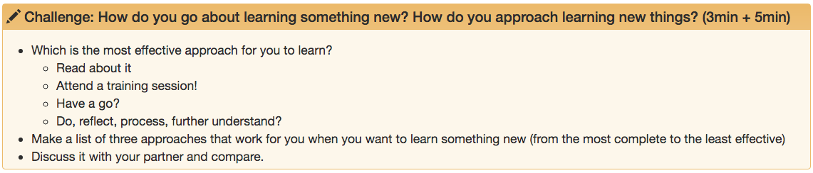

# Train the Trainer Course

This repository generates the corresponding lesson website from [The Carpentries](https://carpentries.org/) repertoire of lessons. 

## Contributing

We welcome all contributions to improve the lesson! Maintainers will do their best to help you if you have any
questions, concerns, or experience any difficulties along the way.

If you would like to contribute to the content of the lesson itself, please refer to the [Episode-Editing Guide](#Episode-Editing-Guide) below.

If you want to learn about the general contributuion guidelines for Carpentries lesson we'd like to ask you to familiarize yourself with our [Contribution Guide](CONTRIBUTING.md) and have a look at the [more detailed guidelines][lesson-example] on proper formatting, ways to render the lesson locally, and even
how to write new episodes.

Please see the current list of [issues][FIXME] for ideas for contributing to this
repository. For making your contribution, we use the GitHub flow, which is
nicely explained in the chapter [Contributing to a Project](http://git-scm.com/book/en/v2/GitHub-Contributing-to-a-Project) in Pro Git
by Scott Chacon.
Look for the tag . This indicates that the mantainers will welcome a pull request fixing this issue.  

## Maintainer(s)

Current maintainers of this lesson are 

* Allegra Via
* Patricia Palagi
* Pedro Fernandes
* Pedro Faria

## Authors

A list of contributors to the lesson can be found in [AUTHORS](AUTHORS)

## Citation

To cite this lesson, please consult with [CITATION](CITATION)

[lesson-example]: https://carpentries.github.io/lesson-example

 
 
 
 
 
 
 
 

# Episode-Editing Guide

 

## Table Of Contents

- [Summary](#Summary)
- [Introduction](#Introduction)
- [Processes and Architecture on Top of the Carpentries-Style Template and Automation](#Processes-and-Architecture-on-Top-of-the-Carpentries-Style-Template-and-Automation)
- [Editing Instructions and Guidelines](#Editing-Instructions-and-Guidelines)
  - [Episode File Structure](#Episode-File-Structure)
    - [YAML Header](#YAML-Header)
    - [Website Content](#Website-Content)
    - [Challenges](#Challenges)
    - [Liquid Comment Section](#Liquid-Comment-Section)
      - [GitHub-Only](#GitHub-Only)
      - [Slides Content](#Slides-Content)
        - [Full Presentation](#Full-Presentation)
  - [Editing](#Editing)
    - [Main concerns](#Main-concerns)
      - [Why We Need HackMD](#Why-We-Need-HackMD)
      - [File Creation and Naming](#File-Creation-and-Naming)
        - [Lesson Structure YAML File](#Lesson-Structure-YAML-File)
        - [Creating-Deleting-Renaming an Episode](#Creating-Deleting-Renaming-an-Episode)
    - [GitHub Editing](#GitHub-Editing)
    - [HackMD Editing](#HackMD-Editing)
      - [Setting Up HackMD](#Setting-Up-HackMD)
        - [HackMD Account](#HackMD-Account)
        - [Browser Extension](#Browser-Extension)
        - [Permissions](#Permissions)
          - [GitHub Permissions](#GitHub-Permissions)
          - [HackMD Permissions](#HackMD-Permissions)
      - [HackMD Basics](#HackMD-Basics)
        - [Notes](#Notes)
        - [Push and Pull](#Push-and-Pull)
    - [GitHub Editing](#GitHub-Editing)
    - [Editing the YAML Header](#Editing-the-YAML-Header)
  
 

## Summary

This is a guide for anyone who wants to edit these episodes. The reason for having such a guide is that, unlike many simpler repositories, the episode files in this folder might undergo some extra automatic transformations after each edit/commit. They are also meant to be used both by GitHub Pages and HackMD, which requires some extra care with the formatting. This does not mean it is much more complicated than contributing to any other Carpentries lesson, so do not let the size of the guide scare you. Most of it are things you are probably already familiar with if you have done it before, but we like to have it as a reference that you can go back to, just in case.

 

## Introduction

The episodes of this lesson can be found in the [\_episodes](_episodes) folder. We recommend reading
this guide before editing.

Below you will find a careful explanation of how to edit each file. Despite not being strictly necessary, if you want to dig a bit deeper and better understand some of the transformations that the files might undergo, as well as the scripts that execute them, you can check these links:

- [Workflows](.github/workflows)
- [Lesson-building Scripts](bin/build_lesson)
- [Slides Resources](slides)

 

The links take you to the **.github/workflows**, **bin/build_lesson** and **slides** folders, respectively. All of them are folders in this repository.

The first folder contains files that are meant to be executed by _GitHub Actions_. You will find there a file named **build_lesson_wf.yml**, which is a YAML file, and recognised by GitHub as a workflow. What this means is that GitHub will execute the code in this file whenever some event is detected. The events that trigger it are defined within the file itself, but you can also find that information in the README.md file in that folder. Just for the sake of completeness and brevity, know that at the time of writing, the triggering events are usually any push/commit to the gh-pages repository, or a push/commit to a small subset of folders.

The second folder contains the actual script that is run by the aforementioned workflow, as well as a yaml file containing data pertaining to the episode titles and their relative order. It also contains a README.md file with further information.

The third folder contains not only the markdown file with the final slides content, which is called **slides.md**, but also two other markdown files with information that is automatically added to the first one. It also contains a README.md file with further information.

 

## Processes and Architecture on Top of the Carpentries-Style Template and Automation

As we have mentioned before, this lesson is built using a Carpentries template, with all the automation scripts that it entails. However, for this particular lesson (Train the Trainer), and as we have also mentioned before, we have added some extra automation, as well as folders. Before going ahead into the guide to read about those details, take a look at the diagrams below. They offer a visual aid to understanding that extra layer of automation.

The first diagram briefly describes the **build_lesson_wf.yml** workflow and its associated scripts and resources.

**Note**: In this context, **workflow** has a very precise meaning . It is a **GitHub Actions** workflow. For more details on GitHub Actions check its [documentation](https://docs.github.com/en/free-pro-team@latest/actions/learn-github-actions) (this is not necessary to contribute to this lesson, mind you).

 

**Fig: Workflow**

 

## Editing Instructions and Guidelines

 

### Episode File Structure

Each episode markdown file can be composed of three different sections, two of which can be omitted:

- **YAML Header** (cannot be omitted) 
- **Website Content**
- **Liquid Comment Section**

The **Liquid Comment Section** can, in turn, be composed of two different subsections, both of which can be omitted:

- **GitHub-Only**
- **Slides Content**

 

#### YAML Header

A section of this type should be found at the top of the episode file. It is the only one that cannot be omitted, otherwise the file will not be recognised as an episode. It follows the YAML syntax and looks as depicted below, although the order in which the key-value pairs appear might differ (in the YAML syntax the order of these pairs is not relevant for the correct parsing of the information therein contained).

 

**Example 1**
~~~
---
exercises: 0
keypoints:
- Reflect upon concepts around learning, training and teaching.
- Internalize and learn to mentally structure several ideas and concepts related to
  learning, training and teaching.
outcomes:
- Get a clear understanding of the goals of this session and of the skil the learners
  are expected to acquire.
questions:
- What are the goals and intended learning outcomes of this session?
slides_url: https://hackmd.io/@nyTtT/r1tHvVR4w#/
teaching: 3
title: S1E1-Session description - Training techniques that enhance learner participation
  and engagement

---
~~~

 

As you can see in the example above, there are seven keys (also referred to as fields):

- exercises
- keypoints
- outcomes
- questions
- slides_url
- teaching
- title

 

The information in the YAML header is chiefly responsible for generating the header in the corresponding website and episode (which follows a _Carpentries_ template), as well as the **Key Points** section (which, if it exists, can be found at the bottom of each episode page). **Example: YAML Header** above would generate the following header and **Key Points** section (**Fig: YAML Header** and **Fig: Key Points**):

 

**Fig: YAML Header**

 

**Fig: Key Points**

 

In the header, **Slides** (in blue) is a link to whatever URL is assigned to the 'slides_url' field in **Example: YAML Header**. The link will take you to the first slide of that episode. In case an episode does not have any slides, the link will take you to the first slide of the last episode before that one that had slides.

 

#### Website Content

Below the YAML header, everything you write is what we call the main body of the file. All of the content in that main body, apart from comments, will feature on the website, in the webpage corresponding to the episode. In the next section ([Liquid Comment Section](#Liquid-Comment-Section)) we will show you how to add comments to the main body. These will be written within a tag defined in the Liquid template language, for which reason we might also refer to them as Liquid comments.

 

##### Challenges

Carpentries-style websites can have pre-defined sections for their episodes, which will have a specific look and feel, depending on their purpose. The one that is particularly relevant to us is the **Challenge** section, which looks as depicted below (**Fig: Challenge**):

 

**Fig: Challenge**

 

Below you can see the piece of markdown text and liquid tag responsible for generating the section above:

~~~
> ## Challenge: How do you go about learning something new? How do you approach learning new things? (3min + 5min)
>
> - Which is the most effective approach for you to learn?
>   - Read about it
>   - Attend a training session!
>   - Have a go?
>   - Do, reflect, process, further understand?
> - Make a list of three approaches that work for you when you want to learn something new (from the most complete to the least effective)
> - Discuss it with your partner and compare.
{: .challenge}
~~~

 

Notice the two aspects needed to create a **Challenge** section:

- **Greater than** symbol (**>**) before every line of text. The empty space between every **>** and the first letter of each line is unnecessary and changes nothing about the rendering (we use it merely for readability purposes in the markdown file itself). 
- The **{: .challenge}** tag at the end of the piece of text.

 

The empty line between the first and third lines is unnecessary and changes nothing about the rendering (we use it merely for readability purposes in the markdown file itself).

We should note that the text in the first line is absolutely up to you. There is no need to include the word **Challenge**, nor the particular header type that we show in the example (in our case, the **##** header type). Our use of these was a choice.

We recommend against numbering the **Challenge** sections, as this makes it harder to maintain the episodes. If you were to number them and you wanted to add a new **Challenge** you would have to change the numbering of all the subsequent challenges. This is only practical if there is an automatic mechanism to do so, which is not the case.

 

#### Liquid Comment Section

Since Carpentries-style websites use the Liquid template language they can also make use of the comment tags that come with the latter. If you want to add a comment that will not show up on the website, you just have to write it within the beginning tag **** and the ending tag ****. Here is an example:

 

~~~


This is a comment in the Liquid template language. It will not show up on the website,
but you can still see it on a text file or on a markdown viewer, like the one on GitHub.
The empty lines right after the beginning tag and right before the ending tag are a matter
of choice.


~~~

 

##### GitHub-Only

If there is content that you would like to add to the markdown files (e.g. for people to read using the GitHub markdown viewer) but to not show up on the website, you can use the Liquid comment anywhere and as many times as you would like on the text.

 

##### Slides Content

Since Liquid comments are invisible to the generated website, we use it here to also add the content for the slides. The slides are meant to be shown using [HackMD](https://hackmd.io/team/nyTtT?nav=overview).

In order to add content to the slides we use the **$$$** tag within the liquid comment tags. So, it would look something like this:

 

~~~


This is a comment in the Liquid template language. It will not show up on
the website, but you can still see it on a text file or on a markdown viewer,
like the one on GitHub. The empty lines right after the beginning tag and right
before the ending tag are a matter of choice.

$$$
This is content that will not show up on the website, since it is within the Liquid
comment tags, but it will be used in the slides.
$$$

This is another comment in the Liquid template language.


~~~

 

We recommend not leaving an empty line between the **$$$** tags and the content, as it may lead to bad formatting.

The slides section has to be inside the first Liquid comment, and there can only be one slides section. All the others
will be ignored. So, for the sake of simplicity, we recommend you only have one Liquid comment section at the end of the
file and one slides section within it.

There is one other thing to consider when building the slides - how does one delimit the content for just one slide?
The way to tell HackMD that a slide is over and another one begins is by adding three dashes (**---**) between them. **Example: Slide Delimiter** illustrates this:

 

**Example: Slide Delimiter**

~~~


$$$
This is content for a slide

---

This is content for the next slide
$$$


~~~

 

However, as you will see in the next section, in our case, we will have to be a bit more careful.

 

###### Full Presentation

The full presentation is built by the python script **build_lesson.py**. It extracts the slides content from each episode and concatenates
them into one markdown file. Because of this, we also have to add the delimiter to the end of the last slide, not just between slides. **Example: Episode Slides** illustrates this.

 

**Example: Episode Slides**
~~~


$$$
### Writing learning outcomes using assessable verbs

 

1. Think about what learners will be able to do by the end of instruction
2. Use the sentence:
    - By the end of the lesson (session/course/instruction) the successful
    learner will be able to......... 
3. Replace dots with a verb that you can assess (name, explain, solve,
distinguish, etc.).
4. Avoid verbs that are open to many interpretations: e.g., appreciate,
have faith in, know, learn, understand, believe

---

## Challenge: How do I write LOs?

1. Think of a lesson/session you usually deliver 
2. Write one or more Learning Outcomes for the lesson/session
3. Write to the GDoc the title of the lesson/session and the corresponding LO(s)

---
$$$


~~~

 

As you can see, even the last piece of content has to have a delimiter. The result will look like in **Fig: Episode Slides 1**
and **Fig: Episode Slides 2**

 

**Note:** the \  tag allows you to add an extra empty line. It is useful when you want to have bigger spacing between two pieces of content in a markdown file.

 

**Fig: Episode Slides 1**

 

**Fig: Episode Slides 2**

 

As a reminder, you can also see the presentation in full screen. To do this in Chrome do the following:

1. Go to the top right corner.
2. Click the three vertical dots. A drop-down menu will appear.
3. Go to the Full Screen symbol, as shown in **Fig: Full Screen**. Click it.
4. If you want to exit Full Screen mode you can try the Esc button or going with the mouse pointer to either the left or the right top corner of
the screen (Mac is usually left, while Windows is usually right), until the window buttons appear and allow you to set the screen to Normal mode.

 
 

**Fig: Full Screen**

 

Notice that in all the slide figures above you can see a little grey box in the bottom right corner of the screen. This indicates the slide number.

If you are not in Full Screen mode you should also be able to see the address bar. There will be a number at the end of the web address of each slide page. This is not the slide number, but it is close. It is the slide number - 1. It provides a way for you to jump to any slide you want, simply by going to the address bar and typing the number.

 

### Editing

#### Main Concerns

##### Why we need HackMD

As mentioned before, this lesson/course uses [HackMD](https://hackmd.io/team/nyTtT?nav=overview). The sole purpose of this choice was to easily generate
slides corresponding to the content shown on the website. The reason for using HackMD for slides (instead of Powerpoint) was to have its content be versionable. HackMD is a user-friendly online tool to create and edit markdown files (as its name implies: Hack + MD). It was also built from the ground up to sync with GitHub, which is where the versioning capabilities come from. Moreover, markdown files on HackMD can be shared with different users, which makes them amenable
to collaborative work.

As you will see in the following sections, the episodes of this lesson can both be edited on GitHub directly or on HackMD. However, if you want the slides
to work, you will always need to go to the slides file on HackMD and pull the most recent version from GitHub (if you already have the latest version of the slides on HackMD then you won't need to do anything).

You might be wondering if you can edit everything on GitHub and just use HackMD to pull the most recent version of the slides. This is almost true, except for one thing: **images**. HackMD only recognises images that have been uploaded into its platform. So, if you want your images to display, you will have to use
HackMD to upload the images there. Luckily, that is extremely easy to do. We will show you how to do it in one of the sections below.

In conclusion, having a presentation that is versionable on GitHub is not yet very straightforward. Maybe in the future there will be an easier way of doing it, but for now, we need to use a tool like HackMD in conjunction with GitHub to achieve that goal. Once you get used to it though, it will not be that hard.
We aim to make this section of the guide as complete and easy to follow as possible, so that you know how to do it.

 

##### File Creation and Naming

This was another concern, and the other reason why editing has to be done in a specific way. The Carpentries website template uses the [\_episodes](_episodes) folder to store the episodes files and generate the lesson from them. However, one has to have them sorted correctly in the folder, as that order will be mirrored on the website. Since GitHub sorts files alphabetically, we cannot just name them whichever way we want, otherwise we would not get them ordered as they should. The quick fix to this is simply adding a number at the start of every file name, which will force the correct relative order. Unfortunately, this creates another issue, which is related to the maintainability of the episodes. If we want to remove or add an episode we might have to manually change the numbering of all the subsequent ones. In this case, the only way to mitigate this issue was to create a script that would sort the episode files according to a pre-defined order, which could be achieved by having it automatically add a prefix to the file names according to a YAML file with an ordered list of the episodes. This is precisely the approach we chose.

 

###### Lesson Structure YAML File

In the [bin/build_lesson](bin/build_lesson) folder you will find the [lesson_structure.yml](bin/build_lesson/lesson_structure.yml) file. It contains a section, under the 'lesson' field, that lists all the episodes and how they fit into each session. It follows the YAML syntax and is structured as a list of lists. The example below (**Example: Lesson Structure**) shows what it looks like at the time of writing of this guide.

 

**Example: Lesson Structure**

~~~
 lesson:
 -
  - "Session Description - Principles of learning and how they apply to training and teaching"
  - "Introduction - Principles of learning and how they apply to training and teaching"
  - "Theoretical Principles and Resources"
  - "How Learning Progresses"
  - "Working Memory, Long-Term Memory and Learning"
  - "Improving Working Memory"
  - "Wrap-up - Principles of learning and how they apply to training and teaching"
 -
  - "Session Description - Training techniques that enhance learner participation and engagement"
  - "Introduction - Training techniques that enhance learner participation and engagement"
  - "Skills for Trainers"
  - "Learning Principles"
  - "Motivation and Demotivation"
  - "Strategies for Active, Interactive and Collaborative Learning"
  - "Wrap-up - Training techniques that enhance learner participation and engagement"
 - 
  - "Session Description - Design and plan session, course, materials"
  - "Introduction - Design and plan session, course, materials"
  - "Design of a Mini-Training"
  - "From Lesson to Session Plan"
  - "From Lesson to Course Planning"
  - "Wrap-up - Design and plan session, course, materials"
 -
  - "Session Description - Assessment and feedback in training and teaching"
  - "Introduction - Assessment and feedback in training and teaching"
  - "Formative Assessment"
  - "Feedback"
  - "Wrap-up - Assessment and feedback in training and teaching"
~~~

 

As you can see, this is a list with two levels (otherwise know as a list of lists). The first level maps to the sessions. Then, within each session, you will have the list of episodes. Notice that they are not numbered. This makes it easier to maintain, since adding or removing any titles is as easy as going to the specific location on the list and inserting/deleting said title (or set of titles). No need to update any numbers, which is taken care of automatically by the script every time a change is made to an episode in the \_episodes folder. There is, however, the extra overhead of going to the YAML file and changing the list whenever you want to add or remove an episode, but we feel it is less work than the alternative. At the time of writing, to edit the episodes you have both to change this YAML file and then create, delete or rename the episode file. We would like to have the latter step be done automatically as well, but such a script has not been done as of yet.

 

The [lesson_structure.yml](bin/build_lesson/lesson_structure.yml) file also contains a field called **slides_base_url**. Once you have the **slides.md** as a note on HackMD (look at section [Notes](#Notes)), copy-paste the base URL into this field. By 'base URL' we mean the address to the first slide. For example, at the time of writing, the base URL is https://hackmd.io/@nyTtT/r1tHvVR4w#/. All the other slides have a number at the end, corresponding to each subsequent page. So, you would have https://hackmd.io/@nyTtT/r1tHvVR4w#/1 for the second slide, https://hackmd.io/@nyTtT/r1tHvVR4w#/2 for the third slide, and so on.

 

###### Creating-Deleting-Renaming an Episode 

Now that you know about the [lesson_structure.yml](bin/build_lesson/lesson_structure.yml) file, we will describe in detail the steps you have to take in order to create, delete or rename an episode file.

 

Create (directly on GitHub):
  1. Go to the [lesson_structure.yml](bin/build_lesson/lesson_structure.yml) file and insert the title of the new episode in the correct position in the list.
  2. Select over and copy a full YAML header (including the **---** delimiters) from an existing episode.
  3. Go to the [\_episodes](_episodes) folder and click **Add file**. A dropdown menu with the two options **Create new file** and **Upload files** should appear.
  3. Click **Create new file**.
  4. The file editor will open and the cursor will be placed in the input field where yuo are asked to 'Name your file...'. Give it whichever name you want, as long as the extension is **.md**.
  5. Paste the previously copied YAML header into the file.
  6. Go to the **title** field in the YAML header and write the exact same title that you inserted into the [lesson_structure.yml](bin/build_lesson/lesson_structure.yml) file.
  7. If you wish, add content to the main body of the file. Then, commit (giving your commit a name and description is optional).
  8. You should now be taken to the [\_episodes](_episodes) folder again. Wait a few seconds and then refresh. The new episode file should now appear with the title you inserted and a prefix of the form **SiEj**, where **i** and **j** refer to the session and episode numbers, respectively.
  
As an example, if your title was 'The wonderful pleasures of teaching' and it corresponds to the 11th episode in session 8, you will now have a file named **S8E11 - The wonderful pleasures of teaching.md** in your [\_episodes](_episodes) folder.

 

Delete (directly on GitHub):
  - We will not go into too much detail, as the steps are almost the same as before. The difference is that, instead of inserting a title and creating an episode file, you will now be removing said title from the [lesson_structure.yml](bin/build_lesson/lesson_structure.yml) file and deleting the episode file.

 

Rename (directly on GitHub):
  - Again, this is almost the same as creating an episode file. Just rename it in the [lesson_structure.yml](bin/build_lesson/lesson_structure.yml) file and in the YAML header of the episode file and you are set. No need to change the name of the file itself, as the scripts will take care of that.

 
 
 

You might still have a few questions:

 

---

 

**Q**: What happens if I forget to add the title in the [lesson_structure.yml](bin/build_lesson/lesson_structure.yml)?  

**A**: If the file you create in the [\_episodes](_episodes) folder does not have a matching title in [lesson_structure.yml](bin/build_lesson/lesson_structure.yml) you will see an **Unrecognised** prefix added to it and it will not be taken into consideration for the slide generation. But everything will be fine otherwise, with the file you created still in the folder and still being used to generate the website.

 

---

 
  
**Q**: What happens if I forget to add the **.md** extension?  

**A**: The file will be ignored, but it will still be in the folder. It will not be taken into consideration for the slide generation nor for the website. Subsequent edits to other episode files might not manifest on the website and the scripts might not work either, because having a non-markdown file in the folder might break the build process. If you add the **.md** extension everything should be fine again.
  
 

---

 
  
**Q**: What happens if I forget to add the YAML header?  

**A**: The file will be ignored, but it will stay in the folder. Subsequent edits to other episode files might not manifest on the website and the scripts might not work either, because having file without a YAML header in the folder might break the build process. If you add the YAML header or delete the file everything should be fine again.

 

---

 

**Q**: I have noticed that the title I added in the YAML header of an episode has been automatically updated with a **SiEj** prefix. Now I want to change that title. Do I replace just the title and leave the prefix in the YAML header? Or do I overwrite the whole thing?

**A**: It does not matter. You can either leave the prefix or replace everything with the new title. As long as the title is recognised, the algorithms will take care of adding the prefix if it is not there.

 

---

 

**Q**: What happens if I give the same title to two or more episodes?

**A**: Do not do that. Currently, the algorithm will not work properly and it will not recognise one of them. For example, do not name two episodes in different sessions with the title 'Introduction'.

 

---

 

**Q**: Should I avoid titles with symbols like **?**, **:**, **,**, **;** and other unusual symbols for file names?

**A**: Yes.

 

---

 
 
 

###### Editing The YAML Header

The YAML header in each episode file is straightforwards to edit, especially if you have edited Carpentries lessons before or if you know YAMl syntax. As mentioned before, the order in which the fields can appear might vary, but this is not an issue. It just might make it harder to see the fields straigh away. We should also point out that even when the value for a field is a string you do not need to enclose it in either double or single quotes. Whether you do or you do not, the result will be the same.

The **slides_url** field is not to be edited directly on the episode files. These URLs are automatically generated from the base slide URL, which can be found in the [lesson_structure.yml](bin/build_lesson/lesson_structure.yml) file, in the field **slides_base_url**. This is where you need to add the URL for the slides, once you have them all in one note in HackMD.

 

#### GitHub Editing

In this guide we assume that you are familiar with editing directly on GitHub (or locally in your machine and then pushing to GitHub). In any case, we thought it better to just add a few notes on this subject, especially since there are some aspects that might give you trouble if you are not careful.

 

##### Waiting for the Scripts to Run

As you probably know by now, this repository uses **GitHub Actions**. This means that every time you commit or push to it, there will be a script running in the background, for a few seconds. This script might make a few changes to the files you just edited, but you will not see these changes right away. We recommend waiting a few seconds and then refreshing a page in order to see the changes you expect. However, if you are not sure whether or not you have waited long enough, you can always check the **Actions** tab of your repository. Below we give you a detailed explanation of how to use and interpret  the **Actions**
tab.

 

###### Actions Tab

TBD

 

###### Potential File Conflicts Due to GitHub Actions

If you are familiar with GitHub then you will know that one of the reasons it was created was to allow people to collaborate more easily. One of the most important parts of this process is having a system that helps its users deal with file inconsistencies that arise from having more than person accessing and modifying the same file.

TBD (show screeshot of conflict, solution on editing directlly GitHub is copy-paste)
   
   
##### Slides

TBD

If you want the slides to work you still have to go to the TtT slides file on HackMD and pull the most recent version of **slide.md** from GitHub.

#### HackMD Editing

##### Setting Up HackMD

###### HackMD Account

TBD

Get a HackMD account (using your GitHUB ID is the easiest way)

###### Browser Extension

TBD

This will allow you to have the 'Edit with HackMD' button on your GitHub editor.

If you are using Chrome go here

If you are using Firefox go here

###### Permissions

TBD

- GitHub Permissions
  - Make sure you have the permissions for the GitHub repository you will be working on
    

- HackMD Permissions
  - Make sure you have the permissions to work on the notes everyone is working on. these notes should be part of a common team (which can be created on HackMD).

##### HackMD Basics

###### Notes

TBD

HackMD uses notes. Each note is a markdown file.
We are using one note for each episode and then there is one note corresponding to the full slides presentation

- Episode Notes
- Slides Note

###### Features

TBD

Recommendations for Adding Images
  group as one image
 
Adding images
  Resizing images

##### HackMD Button

TBD

If you want to edit with HackMD this is one way of doing it.
github editor also opens (you will have to exit after, saying yes to not saving changes)

##### Push and Pull

TBD

- if you forget to pull

- don't switch

- give it some time

- first time vs every other time

- exiting a note (issue)

if you edit and then push slides file from hackMD to github it won't do anything

de-synching from HackMD if file name changes (e.g. someone changed it on GitHub, whether it is the prefix or the title)
  pulling won't work
  go through github hackmd edit button

