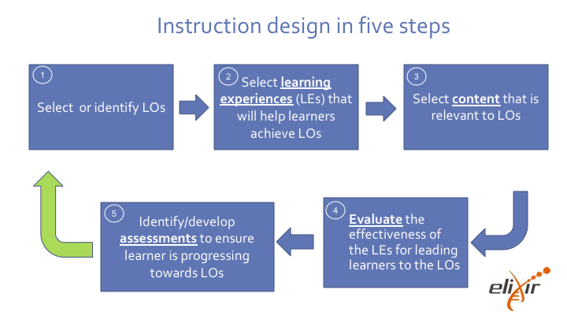

## Introductory video

[Mazur's video on Peer Instruction for Active Learning](https://www.youtube.com/watch?v=Z9orbxoRofI)

[https://hackmd.io/@X6W3UQEtR7m_0hsM2RbwzA/HkCxB5p1P#/4](https://hackmd.io/@X6W3UQEtR7m_0hsM2RbwzA/HkCxB5p1P#/6)

## Instruction design in five steps

[https://hackmd.io/@X6W3UQEtR7m_0hsM2RbwzA/HkCxB5p1P#/5](https://hackmd.io/@X6W3UQEtR7m_0hsM2RbwzA/HkCxB5p1P#/7)

