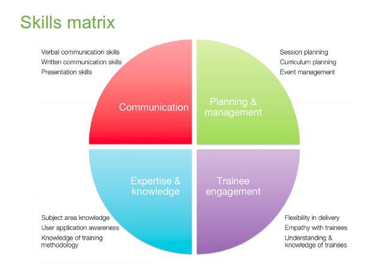

> ## Challenge 1 - Recall concrete examples of past trainings and list your thoughts
>
> 
{: .challenge}

> ## Challenge 2 - What makes a good trainer?
>
> In pairs  
> What makes a good trainer?
> Write down some traits that you associate with a good trainer and describe them.
{: .challenge}

## Example - GOBLET trainer skill matrix 

> ## Challenge 3 - Reflect upon your current skills
>
> Try to reflect on your current skills and how they fit with this matrix
> - Communication (C)
> - Expertise and knowledge (EK)
> - Planning and Management (PM)
> - Learner engagement (LE)
> Then share your thoughts with us
{: .challenge}


## The extended content starts here (from the Excelerate repo)

### Bla bla bla
- This is something
- This is something else

$$$
The triple dollar sign is  
a slide section (the content will be used to generate the slides)

---

## some section
### some subsection

$$$


