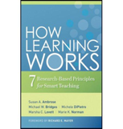

## 7 evidence-based learning principles

#### Principle P1:
Students' prior knowledge can help or hinder learning.

#### Principle P2:
How students organise knowledge influences how they learn and apply what they know.

#### Principle P3:
Students motivation determines, directs and sustains what they do learn.

#### Principle P4:
To develop mastery, students must acquire component skills, practice integrating them, and know when to apply what they have learned.

#### Principle P5:
Goal-directed practice coupled with targeted feedback enhances the quality of students' learning.

#### Principle P6:
Students' current level of development interacts with the social, emotional, and intellectual climate of the course to impact learning.

#### Principle P7:
To become self-directed learners, students must learn to monitor and adjust their approaches to learning.

> ## Challenge 4 - What is your understanding of these learning principles?
> - Work in groups of three
> - Carefully read the principles as a group
> - Pick one principle you like (with no overlap with the other groups)
> - Discuss what you would do as a teacher/instructor to facilitate learning according to the principle
{: .challenge}

> ## Challenge 5 - what is your understanding of these learning principles?
> ### Example
> Principle 2: How students organise knowledge influences how they learn and apply what they know.
>  
> Possible teaching practices:
> - Teach learners how to build and use concept maps
> - Provide learners with a scheme and show them how every new concept/fact fits into the scheme
> - every time a new concept/fact is ontroduced, explain how it fits into the general picture
{: .challenge}

{%comment}

$$$

### Learning principles

 

- Section description
    - Objectives:
    - Learning outcomes:
- Topics
    - 7 evidence-based learning principles
- Challenges
    - What is your understanding of these learning principles?

---

### 7 Evidence-based Learning Principles

 

- Principle P1: Students' prior knowledge can help or hinder learning.

- Principle P2: How students organise knowledge influences how they learn and apply what they know.

- Principle P3: Students motivation determines, directs and sustains what they do learn

---

- Principle P4: To develop mastery, students must acquire component skills, practice integrating them, and know when to apply what they have learned

- Principle P5: Goal-directed practice coupled with targeted feedback enhances the quality of sudents' learning

---

- Principle P6: Students' current level of development interacts with the social, emotional, and intellectual climate of the course to impact learning

- Principle P7: To become self-directed learners, students must learn to monitor and adjust their approaches 	         to learning.

---

### Challenge 4 - How do you understand principles of learning (10 min)?

 

- Work in groups of three
- Carefully read the principles as a group
- Pick one principle you like (with no overlap with the other groups)
- Discuss what you would do as a teacher/instructor to facilitate learning according to the principle

---

$$$

{%endcomment}
