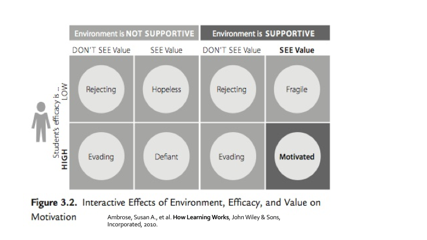

> ## Challenge 6 - Motivation
> Think about a motivating experience in your life (as a student or as an instructor/teacher) and share it in the GDoc.
{: .challenge}

## Value
- Attainment value
  + Satisfaction that one gains from mastery and accomplishment of a goal or task 
- Intrinsic value
  + The satisfaction that one gains simply from doing the task rather than from a particular outcome of the task
  + It is the source of intrinsic motivation
- Instrumental value/extrinsic rewards 
  + Praise
  + Public recognition
  + Money
  + Material goods
  + An interesting career
  + A high-status job, etc.) 

## Efficacy
- Positive outcomes expectancies for success
- Growth vs fixed mindset  
- Efficacy expetancies represent the belief that one is capable of identifying, organising, initiating, and executing a course of action that will bring about a desired outcome (Bandura, 1997). 
- Positive outcomes expectancies for success
- Growth vs fixed mindset  
- Efficacy expetancies represent the belief that one is capable of identifying, organising, initiating, and executing a course of action that will bring about a desired outcome (Bandura, 1997). 
- In order to hold a positive expectancy for success, learners must not only believe that doing the assigned work can earn a passing grade (growth mindset), they must also believe that they are capable of doing the work necessary to earn a passing grade

## Environment
- Complex dynamics of the classroom 
- The tone of the classroom 
- The interpersonal forces at play 
- The nature and structure of communication patterns. 
- E.g. "The instructor is approachable and several of my classmates seem willing to help me if I run into troubles". 
- inclusivity

> ## Challenge 7 - What can I do to create a motivating environment?
> Think, pair, share  
> In pairs, think about what you could do to create a motivating environment in your classroom. 
> Share it with us.
{: .challenge}

## Strategies to motivate learners
- Connect the material to students’ interests
- Provide authentic, real-world tasks/example
- Show relevance to students’ current academic lives
- Demonstrate the relevance of higher-level skills to students’ future professional lives
- Identify and reward what you value
- Show your own passion and enthusiasm for the discipline
- Build positive expectations
- Ensure alignment of objectives, assessments, and instructional strategies
- Identify an appropriate level of challenge
- Provide early success opportunities
- Articulate your expectations
- Provide targeted feedback
- Be fair
- Describe effective study strategies
- Give students an opportunity to reflect

> ## Challenge 8 - Demotivation
> Think about a demotivating experience in your life (as a student or as an instructor/teacher) and share it to the GDoc.
{: .challenge}

## Demotivating
Do not
- Dive into complex or detailed technical discussions with one or two people
- Pretend to know more than what you do
- Use diminishing language "just", "simply", "obviously", "don’t you know?"
- Hinder autonomy
- Deliver long unidirectional lectures
