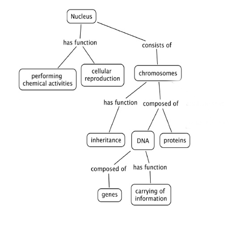
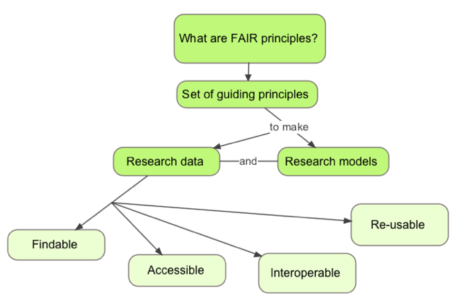

## Practice a 3-min mini-training

- Prepare and plan for delivering training 
- Revise feedback 
- Adjust/improve/modify (according to feedback) for a 3-min presentation

>## Challenge 1 - Define the audience, goal and outcomes (7 min)
>
>1. Choose a topic
>2. Define learning objectives (describe the goals and intentions of the instructor )
>3. Write learning outcomes (think about what learners will be able to do by the end of instruction/session/workshop)
>4. Identify the target audience and prerequisites
>5. Identify the learning experiences
>6. Select the content
{: .challenge}

[https://www.clinton.edu/curriculumcommittee/listofmeasurableverbs.cxml](https://www.clinton.edu/curriculumcommittee/listofmeasurableverbs.cxml)

## Choose a topic for a 3-min training

- Choose a topic to demonstrate your training in three minutes. 
  - How to make an origami bird
  - Introduction to biochemistry
  - How bats recognise the presence of obstacles
  - The second law of Newton
  - How to draw a comic strip

## Concept map

## Concept map - FAIR principles
Parking lot?
What is this supposed to look like?

## Concept maps - How to use the tool
- Concept maps are graphical tools for organizing and representing knowledge
- Include concepts and relationships to link concepts
- Good to start a concept map with a focus question - context
- Help to organize knowledge and to structure it
- Good concept maps are built with iterations and feedback

_Joseph D. Novak , 1972_

## Concept maps in curriculum/lesson/session planning
- They present key concepts in a highly concise manner
- This helps us predict how much we can cover when designing the teaching plan
- The hierarchical organization suggests a sequence to cover material

Further reading [http://cmap.ihmc.us/Publications/ResearchPapers/TheoryUnderlyingConceptMaps.pdf](http://cmap.ihmc.us/Publications/ResearchPapers/TheoryUnderlyingConceptMaps.pdf)

>## Challenge - Draw a concept map (10 min)
>
>Draw a concept map of your topic of interest, start with a question
>
>- Include around 7 (plus or minus 2) concepts
>- Include relationships and cross-links between these concepts
>- Arrange it in a hierarchical structure with the key concepts on top
{: .challenge}

>## Challenge - Feedback on concept maps (8 min)
>
>In a group of 2 exchange concept maps. Do not explain the map.
>
>- Write one thing you are confused/not sure about the map
>- Write one thing you like/it is clear about the map 
>  - Each person will give and receive two feedbacks: 
>  - Positive and Negative on content
{: .challenge}

>## Challenge - Delivery planning (3 min) 
>
>- Think if you want to make your training interactive 
>- Think whether you need or want to use a visual support (images)
>- Think whether you need to distribute material in advance to the audience 
>- Prepare for your choices
>- Be creative!
{: .challenge}

>## Challenge 5 - Prepare content (15 min)
>
>You have 15 min to prepare the content of your mini-training
>The structure of your mini-training should be something like 
>- 40 seconds introduction
>- 2 minutes on topic
>- 20 seconds conclusion
>
>Use your concept map and adapt as needed
{: .challenge}

>## Challenge 6 - Mini-training practice (20 min)
>
>Split into groups of 3
>1. Each will deliver their 3 minute session to the others
>2. One person delivers the session
>3. One person records on the phone (optional) 
>4. One person notes down feedback in real-time
>5. You describe your own feedback (self-feedback) on your delivery
>6. The other two provide feedback to the presenter
>7. Then rotate within the group (and restart from 1)
{: .challenge}

How to give feedback?

## Constructive feedback

## Discussions/feedback

- Listen actively and attentively
- Ask for clarification if you are confused
- Do not interrupt one another
- Challenge one another, but do so respectfully
- Criticize ideas, not people
- Do not offer opinions without supporting evidence
- Take responsibility for the quality of the discussion
- Build on one another ’s comments; work toward shared understanding.
- Do not monopolise discussion.
- Speak from your own experience, without generalizing.
- If you are offended by anything said during discussion, acknowledge it immediately.

