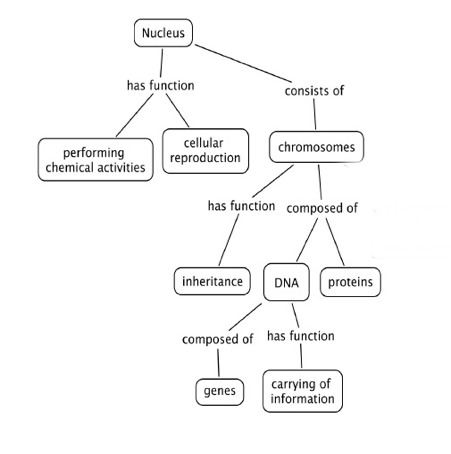

## Practice a 3-min mini-training

- Prepare and plan for delivering training 
- Revise feedback 
- Adjust/improve/modify (according to feedback) for a 3-min presentation

## Challenge 1 - Define the audience, goal and outcomes (7 min)

1. Choose a topic
2. Define learning objectives (describe the goals and intentions of the instructor )
3. Write learning outcomes (think about what learners will be able to do by the end of instruction/session/workshop)
4. Identify the target audience and prerequisites
5. Identify the learning experiences
6. Select the content

[https://www.clinton.edu/curriculumcommittee/listofmeasurableverbs.cxml](https://www.clinton.edu/curriculumcommittee/listofmeasurableverbs.cxml)

## Choose a topic  for a 3-min training

- Choose a topic to demonstrate your training in three minutes. 
  - How to make an origami bird
  - Introduction to biochemistry
  - How bats recognise the presence of obstacles
  - The second law of Newton
  - How to draw a comic strip

## Concept map

## Concept map - FAIR principles
Parking lot?
What is this supposed to look like?

## Concept maps - How to use the tool
- Concept maps are graphical tools for organizing and representing knowledge
- Include concepts and relationships to link concepts
- Good to start a concept map with a focus question - context
- Help to organize knowledge and to structure it
- Good concept maps are built with iterations and feedback

_Joseph D. Novak , 1972_

## Concept maps in curriculum/lesson/session planning
- They present key concepts in a highly concise manner
- This helps us predict how much we can cover when designing the teaching plan
- The hierarchical organization suggests a sequence to cover material

Further reading [http://cmap.ihmc.us/Publications/ResearchPapers/TheoryUnderlyingConceptMaps.pdf](http://cmap.ihmc.us/Publications/ResearchPapers/TheoryUnderlyingConceptMaps.pdf)

## Challenge - Draw a concept map (10 min)

Draw a concept map of your topic of interest, start with a question

- Include around 7 (plus or minus 2) concepts
- Include relationships and cross-links between these concepts
- Arrange it in a hierarchical structure with the key concepts on top

## Challenge - Feedback on concept maps (8 min)

In a group of 2 exchange concept maps. Do not explain the map.

- Write one thing you are confused/not sure about the map
- Write one thing you like/it is clear about the map 
  - Each person will give and receive two feedbacks: 
  - Positive and Negative on content
  
## Challenge - Delivery planning (3 min) 

- Think if you want to make your training interactive 
- Think whether you need or want to use a visual support (images)
- Think whether you need to distribute material in advance to the audience 
- Prepare for your choices
- Be creative!

## Challenge 5 - Prepare content (15 min)

You have 15 min to prepare the content of your mini-training
The structure of your mini-training should be something like 
- 40 seconds introduction
- 2 minutes on topic
- 20 seconds conclusion

Use your concept map and adapt as needed

