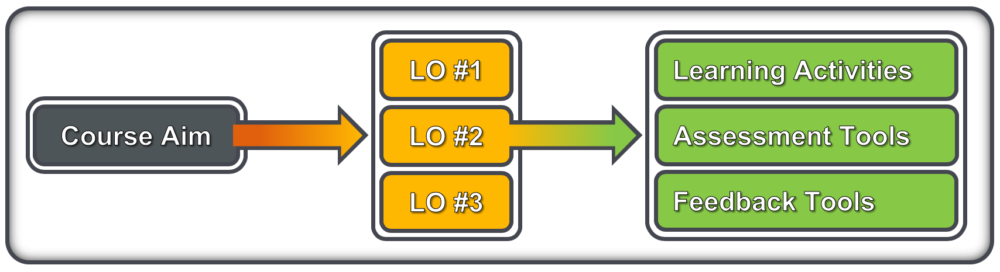

## Delivery planning

- Is it part of an extended curriculum?
- Is the training a requirement, or optional career development?
- Format: workshop, seminar, lecture, online training or mix online/in-person?
- Timing: what is the content and depth of the training?
- Do you need to invite any other external experts? 
- What sort of venue/equipment do you need for this format?

## From session to course – defining the aim

- Combine the who, what and why requirements into a course aim
  - Who: write clear trainee specifications; e.g. undergraduate biologists with basic knowledge of Unix and R
  - What & why: describe what trainees will learn, and the benefit of that
- Consider the where and when requirements (i.e. the logistics)
  - How much can you do in the time available (including tests, feedback)
  - Resources limitations (space, equipment, assistants)

[_Chris Taylor – Earlham Institute_](https://www.mygoblet.org/training-portal/materials/train-trainer-course-materials)

## From learning outcomes to a course outline

- A well-written course aim will guide the generation of LOs

- LOs should then be instantiated as activities and quality checks
  - Learning activities: scripts, slides, exercises, tutorials, …
  - Assessment tools: creative activities, written tests, …
  - Feedback tools: observation, interaction, forms, …
- Learning activities (LAs) should be tightly-linked to quality checks
  - This is not ‘teaching to the test’ because it’s training not education
- When all the LOs are expanded, you have your course outline

[_Chris Taylor – Earlham Institute_](https://www.mygoblet.org/training-portal/materials/train-trainer-course-materials)

## Reproducibility of compute environments

- Different courses, different compute requirements: Unix, R, Python, metagenomics, long read sequencing
- Installation process time-consuming and technically challenging
- Every computer should have an identical installation setup and sufficient hardware (power and memory) to run the tools 
- Virtual machines, cloud computing, containers, software images

## Training rooms for bioinformatics

Physical environment 
- Room geometry: seats’ quality, the lighting, the room temperature control, the stability of power and network connections
- Functionality : video, audio, drawing surfaces (whiteboard, flipchart paper), a corkboard  to pin materials 
- Hardware needs: power suppliers, network connections with a good quality wifi access

## Training materials: sharing and making re-use possible

Learning outcome: Be able to identify training materials that exist already, and develop a routine of sharing training materials.

## FAIR principles

Data and models are:
- Findable - can be searched for by the community after publication
- Accessible - can be read/downloaded by other researchers
- Interoperable - can be understood clearly in the context of the original experiment
- Re-usable - can be used by other researchers

### FAIR principles – In the context of training

Training course materials: slides, exercises, datasets
- Findable - can be searched and found by the trainers community
- Accessible - can be read/downloaded by other trainers
- Interoperable - can be understood clearly in the context of the original course
- Re-usable - can be used by other trainers

## Training materials repositories and resources

- GOBLET – http://mygoblet.org/training-portal
- TeSS - https://tess.elixir-europe.org/
- GitHub - https://github.com
- Jupyter - http://jupyter.org/
- Other?

## Resources

Design: [ftp://gtpb.igc.gulbenkian.pt/bicourses/posters/Calix_March2013.pdf](ftp://gtpb.igc.gulbenkian.pt/bicourses/posters/Calix_March2013.pdf)
Training materials: [https://www.mygoblet.org/training-portal](https://www.mygoblet.org/training-portal)
TeSS: [https://tess.elixir-europe.org](https://tess.elixir-europe.org)
[https://www.clinton.edu/curriculumcommittee/listofmeasurableverbs.cxml](https://www.clinton.edu/curriculumcommittee/listofmeasurableverbs.cxml)
Adopt collaborative platforms to support training activities

## Challenge 9 - Apply (5 min)

Articulate a goal of good teaching practice that you are ready to apply for your next training

## Wrapping-up

What did you learn in this session?
- One person at a time, no repetition

## Time to relax!

