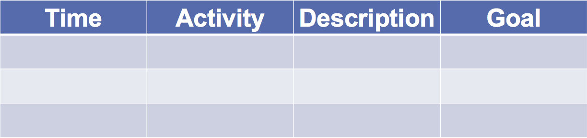

## Tools for session, course, curriculum design

1. FIVE STEPS for session, course, curriculum design
2. Lesson/session plan

## Instruction design in five steps

_Nicholls G (2002). Developing teaching and learning in higher education. London, UK: Routledge. Pp 51-75_

## lesson/session plan

## Example - Plan for a 1h15 session

<table style="width:100%">
  <tr>
    <th>Time</th>
    <th>Activity</th>
    <th>Description</th>
    <th>Goal/Outcome</th>
  </tr>
  <tr>
    <td>9.00-9.15</td>
    <td>Warm-up</td>
    <td>Leaners summarise the key points of each session from the previous day and answer questions from the audience. The instructor describes the plan of the day in detail</td>
    <td>Retrieval from memory, repetiiton, get prepared for new topics, expose learners</td>
  </tr>
  <tr>
    <td>Eve</td>
    <td>Jackson</td>
    <td>94</td>
    <td>94</td>
  </tr>
</table>
