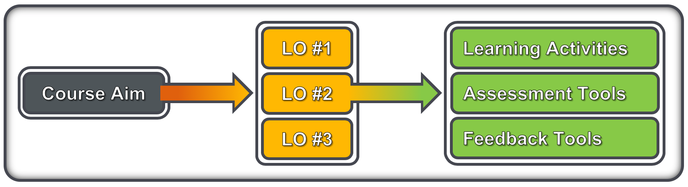

## Delivery planning

- Is it part of an extended curricula?
- Is the training a requirement, or optional career development?
- Format: workshop, seminar, lecture, online training or mix online/in-person?
- Timing: what is the content and depth of the training?
- Do you need to invite any other external experts? 
- What sort of venue/equipment do you need for this format?

## From session to course – defining the aim

- Combine the who, what and why requirements into a course aim
  - Who: write clear trainee specifications; e.g. undergraduate biologists with basic knowledge of Unix and R
  - What & why: describe what trainees will learn, and the benefit of that
- Consider the where and when requirements (i.e. the logistics)
  - How much can you do in the time available (including tests, feedback)
  - Resources limitations (space, equipment, assistants)

_Chris Taylor – Earlham Institute - https://www.mygoblet.org/training-portal/materials/train-trainer-course-materials_

## From learning outcomes to a course outline

- A well-written course aim will guide the generation of LOs

- LOs should then be instantiated as activities and quality checks
  - Learning activities: scripts, slides, exercises, tutorials, …
  - Assessment tools: creative activities, written tests, …
  - Feedback tools: observation, interaction, forms, …
- Learning activities (LAs) should be tightly-linked to quality checks
  - This is not ‘teaching to the test’ because it’s training not education
- When all the LOs are expanded, you have your course outline

_Chris Taylor – Earlham Institute - https://www.mygoblet.org/training-portal/materials/train-trainer-course-materials_
