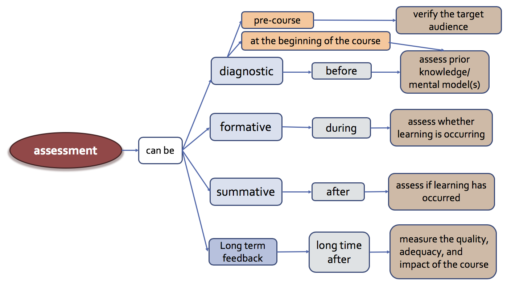

## Introductory videos

[Peer instruction for active learning (Eric Mazur)](https://www.youtube.com/watch?v=Z9orbxoRofI)

[ConcepTests at Avanti's Learning Centre in Kanpur](https://www.youtube.com/watch?v=2LbuoxAy56o&t=2s)

## Different ways to categorize assessment

