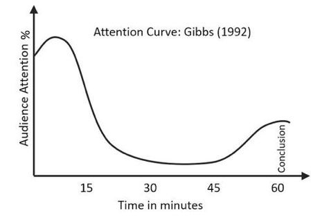
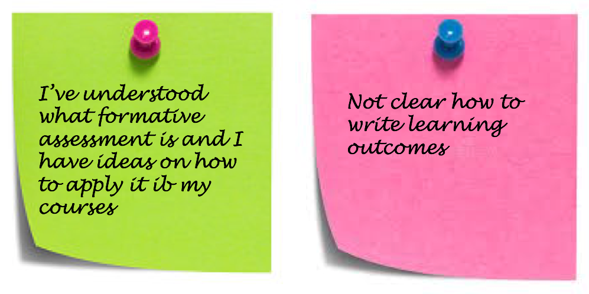
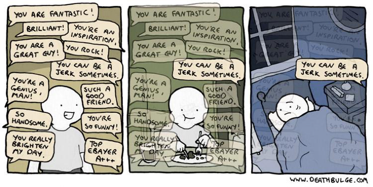
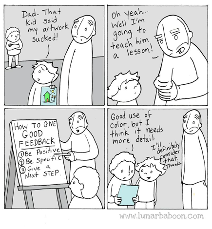

## Fist of five feedback

## Formative assessment should be frequent

- Ideally every 5 min
- At least gni 10-15 min
- Attention span: 10-15 min 
- Refocus attention

### Systematic immediate feedback

- When?
  - Ideally at natural breakpoints such as ending an exercise, shifting to a different subject and right after a wrap-up session.
- How?
  - It should be very focused and expedite in execution. The instructor should think of a clearly stated question that has a binary (Yes/no) or garaded (0-5) response.
  
This is Instant Feedback.

### Feedback from learners

- Assessing learner reactions to teachers and teaching thus providing context-specific feedback that can improve teaching within a particular course.
- Assessing learner reactions to class activities, assignments, and materials thus giving instructors information that will help them improve their course materials and assignments.
- Assessing learner reactions to course organisational aspects, thus providing the organiser information that will help him or her to improve the course organisation;

## Feedback is hard

### Dealing with (bad) feedback

Trainees feedback should be considered along other forms of quality evidence:
- Review what they have effectively learned (in exams)
- Consider your own experience of teaching
- Discuss with colleagues and friends
- Look at the feedback from past sessions of the same course
- Look at the response rates
- Look at the counter examples (contradictions)
- Look at the repetitive patterns (not at only one single answer)
- Breathe deeply
- Humans focus more on negative feedback than on positive (you are not alone)
- Try to see the point in the criticism, learn from it
- Don’t take it personally (easier said than done). Try to focus on what they say about what you do (not who you are)

### Learn and teach others how to give good feedback

## [Short-term feedback questionnaire](https://www.surveymonkey.co.uk/r/XLMJZSC)

[http://bit.ly/2Xgr3cI](http://bit.ly/2Xgr3cI)

