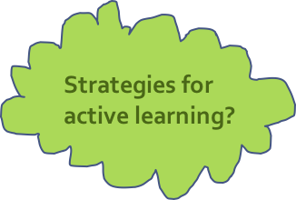

## Active learning
> Learners who actively engage with course materials will end up retaining it for much longer than they would have otherwise, and they will be better able to apply their knowledge broadly.

_Waldrop, Nature 2015_

## Interactive learning
- Participatory engagement 
- Promotes retention
- Develops critical thinking
- Allows you to assess learners
- Learners immediately apply content

Science Education Resource Center at Carleton College (SERC):
https://serc.carleton.edu/sp/library/interactive/

## Strategies for active, interactive, collaborative learning
- Brief question-and-answer sessions 
- Think, pair, share
- Shared notes
- Work in groups
- Peer instruction
- Discussions (may be integrated into lectures)
- Brainstorming
- Impromptu writing assignments
- Hands-on activities
- Experiential learning events
- Establish teamwork by agreement
- Introduce blended multimedia materials
- Instant feedback
- Let learners do recaps
- Introduce physical exercises
- Introduce short, relaxing breaks
- Assign tasks/problems to groups/pairs, giving them time to present their results
- Introduce challenges or games

## Activities and attitudes the instructor should promote
- Listening
- Questions asking
- Group discussions/brainstorming
- Peer instruction 
- Participants' interaction/networking
- Presentations by participants
- Mode/pace/activity frequent change

## Activities and attitudes the instructor should avoid or keep to a minimum
- Unidirectional lecturing
- Individual work out with no feedback
- Providing answers before letting participants doing it
- Keeping the same pace for long time
- Using a monotone modality of content delivery (including the tone of the voice)
- Showing no enthusiasm

## Technique - Wrap-up
Allow time for wrap up and feedback

> ## Challenge 9
> On the GDoc
> 
> One or more new things that you have learned today and could be useful for your future teaching/training
{: .challenge}

> ## Challenge 10 - your vote counts
> Add a + sign next to the point you agree the most
>
> :D - Great I feel I’m learning new things  
> :] - I feel neutral, maybe I need more time to reflect  
> :S - I am more confused then ever
{: .challenge}

## Technique - Short feedback
- Sticky notes: red and green
- Minute cards: positive and negative (anonymous)
- One up, one down: positive and negative (no repetition)

> ## Challenge 11 - One up one down
>  
> 1. Something you liked about what you did (do this again!)
> 2. Something you would like to change (avoid next time)
{: .challenge}



### The seven principles of learning

> **See also**: [Brent R and Felder RM (2011)](docs/how_learning_works_thoughts.pdf)
>
- **Principle P1**:	Students' prior knowledge can help or hinder learning.
- **Principle P2**:	How students organise knowledge influences how they learn and apply what they know.
- **Principle P3**:	Students motivation determines, directs and sustains what they do learn.
- **Principle P4**:	To develop mastery, students must acquire component skills, practice integrating them, and know when to apply what they have learned
- **Principle P5**:	Goal-directed practice coupled with targeted feedback enhances the quality of students' learning
- **Principle P6**:	Students' current level of development interacts with the social, emotional, and intellectual climate of the course to impact learning
- **Principle P7**:	To become self-directd leaners, students must learn to monitor and adjust their approaches to learning.
>
>**Instructional strategies that collectively address all seven principles (P1-P7)**:
>
- **Strategy S1**: Collect data about students and use it to design instruction (P1,P3).
- **Strategy S2**: Be explicit about your learning goals, learning objectives and expecations (P3, P5, P6). Make your learning goals challenging but attainable by most of the learners in your course. Write detailed learning outcomes that spell out what the learners should be able to do (define, explain, calculate, model, critique, design,...) if they have aquired the knowledge and skills you are trying to help them to develop, and share your objectives with the learners.
- **Strategy S3**: Scaffold complex tasks (P2-P7). Teach and test at a level that is challenging but not too far above the learners' current klnowledge and skill levels.
- **Strategy S4**: Help learners learn to funcion like experts (P2, P4, P7). Have learners formulate solution strategies before beginning to work on new problems, and when they complete assignments have them reflect on what they learned and what they will do differently in the future.
- **Strategy S5**: Establish a supportive class climate (P3, P6). Learn and use learners' names and encourage them to interact with you in and out the course. Collect anonymous learner feedback and investigate and respond to any complaints related to class climate.

### Integrating active learning strategies into your course. Learning by doing.

Consider ways to set clear expectations, design effective evaluation strategies and provide helpful feedback.

> We quote from [Richard M Felder and Rebecca Brent](./docs/active_learning_an_introduction.pdf): 
>
>If you think of anything a teacher might ask students to do — answer questions in class,complete assignments and projects outside class, carry out lab experiments, or anything else other than sitting passively in a classroom — you will find people who would classify it as active learning. We find that a more restricted definition limited to in-class activities is more useful: 
>
>*Active learning is anything course-related that all students in a class session are called upon to do other than simply watching, listening and taking notes.*
>
>You are doing active learning in your class when:
> 
* you ask a question, pose a problem, or issue some other type of challenge; 
* tell your students to work individually or in small groups to come up with a response; give them some time to do it; 
* stop them, and call on one or more individuals or groups to share their responses. 
>
>You are **not** doing active learning when: 
>
* you lecture, 
* ask questions that the same few students always answer, 
* or conduct discussions that engage only a small fraction of the class.  
>
>We are not about to propose that you throw out lecturing and make every class you teach a total active learning extravaganza. You know more than most of your students do about your subject, and you need to spend part of your class time teaching them what you know - explaining, clarifying, demonstrating, modeling, etc. 
>
>What we are suggesting is that **you avoid making lecturing the only thing you do**. If a lecture or recitation session includes even a few minutes of relevant activity — a minute here, 30 seconds there —the students will be awake and with you for the remaining time in a way that never happens in a traditional lecture, and most will retain far more of what happens in those few minutes than of what you say and do in the rest of the session.

Our experience suggests that there are activities that should be reduced and activities that should be carried out as much intensively as possible.

**Activities and attitudes the instructor should keep to a minimum**:

- lecturing
- individual work out
- providing answers before letting participants doing it
- keeping the same pace for long time
- using a monotone modality of content delivery (including the tone of the voice)
- showing no enthusiasm

**Activities and attitudes the instructor should promote**:

- listening
- questions asking
- challenging learners
- group discussions/brainstorming
- work in pairs/groups
- problem solving
- peer instruction (using sticky notes, see below Carpentry teaching practices)
- participants' interaction/neworking
- games
- physical exercise
- presentations by participants
- mode/pace/activity frequent change

See also: [The Eberly Center for Teaching Excellence and Educational Innovation ](http://www.cmu.edu/teaching/)

###Gamification
Using games in training may be an effective technique in many aspects.
Games promote:

* ice breaking
* interactivity
* networking
* fun
* pace discontinuity
* relax

Games should be designed/chosen accurately and have specific goals, should not last too much and shouln't be too frequent.
Possible games are:

* **Throw props to recap/rehearse:** Make a list of concepts/keywords and write it on the whiteboard (or a flipchart). You may also have cards stuck on the wall of the classroom with terms written on them. Throw a light and soft object to a participant, who will have catch the object, stand up, pick a term from the list and explain its meaning (or usage) in a few sentences (not more than 20-30 seconds). After the explanation, the participant will throw the object to another participant. Continue until the end of the list.
* **Mimicking**. Make two groups. One person from each group will mimic concepts/keywords (e.g. Python commands). The rest of the group will guess the mimicked concept/keyword. The group employing less time to guess the correct concept/keyword, will get one point. In principle, this should be repeated for each component of the group. This game can also be done without splitting the audience in two groups. 
* **Asking (and answering) questions to each other:** This activity, should the venue and the weather allow it, would be better carried out in outer space. Form two concentric circles of people facing each others. When you clap your hands, the two circles have to turn in opposite directions. A second clap will stop them and each person from the outer (inner) circle will ask a question to the person before him/her and belogning to the inner (outer) circle. Give 45 secs to answer, then clap again your hands to make people move and again to stop them. When they stop (ensure that facing pairs have changed), people from the inner (outer) circle will ask questions and those from the outer  (inner) circle will answer. Repeat for 4-6 questions (and answers).
* **Games to introduce algorithms and/or the logic of programming (i.e., simple but accurate and very specific instructions)**. *Game 1*: divide the class into two groups. Each group will draw a simple geometrical figure and write specific istructions to draw the figure. Groups exchange instructions and try to draw the other group's figure based on the instructions received.
*Game 2*: One person (could also be the instructor) will stand blindfolded in a corner (or at the back) of the classroom. Following instructions of participants, he or she will have to walk to the opposite corner (or the front) of the classroom, without bumping into tables, chairs, etc.

$$$

$$$


