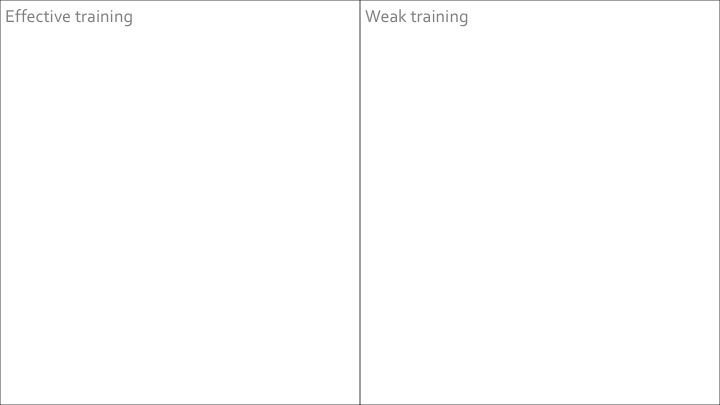
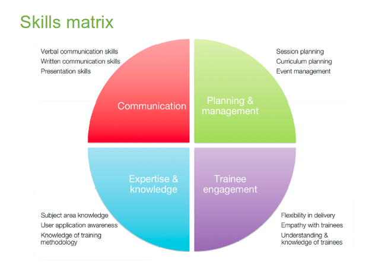

> ## Challenge 1 - Recall concrete examples of past trainings and list your thoughts
>
> 
{: .challenge}

> ## Challenge 2 - What makes a good trainer?
>
> In pairs  
> What makes a good trainer?
> Write down some traits that you associate with a good trainer and describe them.
{: .challenge}

## Example - GOBLET trainer skill matrix 

> ## Challenge 3 - Reflect upon your current skills
>
> Try to reflect on your current skills and how they fit with this matrix
> - Communication (C)
> - Expertise and knowledge (EK)
> - Planning and Management (PM)
> - Learner engagement (LE)
> Then share your thoughts with us
{: .challenge}



### What makes a good training session?

> ### Challenge 1: Training you have been involved in...

>- What makes a good training session?
>- What makes a bad training session?
>
>Think of an example of each that you have participated in and list your thoughts…
>

### Delivering a learning event as a mission; establishing learning mode, teamwork and mutual trust
Start with learning objectives. Once you have defined what learners need to achieve, let learning objectives lead the process.
The class space influences behaviours. The space in the training room can help to redefine how you implement learning objectives throughout the course.
Try to challenge yourself from more traditional, passive and instructor-led methods of teaching to more learner-centric methods that empower learners to be more engaged and involved in the process of skill development, mastery and application.
How can you use classroom space to turn challenges into opportunities for learning?
 
While a lecture or presentation mode can be used to kick-start a session, it can easily be followed by directing students to move to a different learning mode, to access content, their peers and the instructors to support learning. This dynamic interface stimulates both participants and instructors. 

Small groups, team-based exercises, and collaborative endeavours support a variety of learning modes.
Make sure to use clear and well developed protcolos that minimise any loss of time or productivity.
You can leverage multiple learning/teaching modes; indeed, fostering a high order of thinking skills is far more successful when students are given multiple ways to process information.  The variety of tools, flexibility of place to work and a range of people, including instructors, to network with at various intervals empower individuals and generate mutual trust. Provide students easier access to you (the instructor).

Try to give up the position of the "sage on the stage", to become the "guide on the side". This makes learners feel free to interact, ask questions, tell they got lost (when they are) and allows you to better understand what problems participants have,  work individually with those in need of help, and use your time to focus and (re)explain what was not well received.

### What makes a good trainer?

> ### Challenge 2: What makes a good trainer? 
Discuss it in pairs and write down which characteristics you think a good trainer should have.

>[Compare your thoughts with ours](#challenge2)
>
>###Challenge 3: What good teachers have in common? 
>Identify two essential characteristics that good teachers have in common. Discuss with your partner. Write them down and share them with us.
>
>[Compare your thoughts with ours](#challenge3)

### Teaching as a performance art: promoting learner engagement

#### Interactive lectures and closed loop learning delivery

Lectures, as traditionally used in formal learning, are characterised by a unidirectional flow of information, from one instructor to N learners. Only in rare occasions is there information going back to the instructor. Moreover, the instructor is not necessarily worried about the result, i.e. if the information that is sent is sedimenting or not in the learners' brain. So, the instructor can speak for several hours in unidirectional mode.

In training, we also use lectures to convey information, but we make them short, and, n«more importantly we make them fit in a model of delivery that is called a closed loop. The instructor delivers information so that it can be immediately utilised in and exercise or some other form of assessment. The learner perceives the effect of the incoming information and his/her ability to use it, and has an opportunity to interact with the instructor, thus "closing the loop". The instructor uses this mode to ensure that the new knowledge or skill is well sedimented in the learner's brain, and corrects whatever is needed.

>
>#### Interactive lectures as described by the Science Education Resource Center at Carleton College ([SERC] (http://serc.carleton.edu/index.html))
>
>We quote from [the SERC portal for Educators](http://serc.carleton.edu/sp/library/interactive//index.html):
>
>Interactive lectures are classes in which the instructor breaks the lecture at least once per class to have students participate in an activity that lets them work directly with the material. The instructor might begin the interactive segment with an engagement trigger (thought-provoking questions, evocative visuals, physical props, cartoons, photographs, evocative textual passages, clips) that captures and maintains student attention.
>
>An interactive lecture is an easy way for instructors to intellectually engage and involve students as active participants in a lecture-based class of any size. Interactive lectures are classes in which the instructor breaks the lecture at least once per class to have students participate in an activity that lets them work directly with the material.
>
* The instructor might begin the interactive segment with an engagement trigger that captures and maintains student attention.
* Then the instructor incorporates an activity that allows students to apply what they have learned or give them a context for upcoming lecture material.
* As the instructor feels more comfortable using interactive techniques he or she might begin to call upon a blend of various interactive techniques all in one class period.
>
>#### Why use interactive lecture?
Lecturing is a time-honored teaching technique that is an efficient method to present large amounts of content in classes of any size and it is efficient for sharing information with large numbers of students, but may result in students who listen passively.
>
* Making lectures interactive by including techniques such as think-pair-share, demonstrations, and role playing, can foster active engagement and enhance the value of the lecture segments.
* Using techniques that allow all of the students to participate, instead of having individual students answer questions when called on, will promote student retention and learning of the material presented during lecture, give students practice in developing critical-thinking skills, and enable instructors to assess how well the class is learning that day.
* Breaking up the lecture with these techniques not only provides format change to engage students, these activities allow students to immediately apply content and provides feedback to the instructor on student
>
>#### How to give an interactive lecture
Giving an interactive lecture involves creating and delivering an effective segmented lecture with engagement triggers and well-selected interactive lecture techniques.
>
>* The instructor must begin by giving attention to pre-instructional planning and various classroom management and logistical issues that allow for modification from the traditional lecture format. Learning goals must be established for interactive lecture techniques, the instructor must determine what types of tasks will be involved and what sort of engagement trigger might be appropriate for the activity (see more about establishing learning goals).
>* Next, an interactive lecture technique must be selected and adapted for the specific course and content and attention must be given to how student feedback will be collected. In the most interactive of lectures, the instructor's traditional contributions would be short and the interactive activities could be both planned and spontaneous. 

The TtT taskforce of the Global Organisation for Bioinformatics Learning, Education and Training ([GOBLET] (http://mygoblet.org)), developed a skills matrix for trainiers. It aims to provide an  overview of the major skills required to be a good trainer; note that not all trainers will have all skills - that is not the point! 

> ### Challenge 4: The GOBLET skills matrix for trainers
> 1. Try to reflect on your current skills and how they fit with this matrix.  
> 
> 2. Then share your thoughts with us.

>#### Communication skills
>*Verbal communication skills* - able to deliver information orally in a clear manner that is understood by trainees.
>*Written communication skills* - providing written information eg handouts, at the correct level for trainees and in appropriate format
>*Presentation skills* - producing suitable slide-sets for lecture-style sessions; presenting complex information in an accessible manner
>
>#### Expertise and knowledge
>*Subject area knowledge* - having knowledge / expertise in a specific subject
>*User application awareness* - understanding how a learner will apply the information "How will this analysis benefit my work?"
>*Knowledge of training methodology* - awareness of individual learning styles and basic pedagogy
>
>#### Planning and Management
>*Session planning* - able to define the requirements for a single session; be able to plan appropriate activities based on objectives of session and time available;
>*Curriculum planning* - organising a balanced course; clear definitions of target group and course outcomes; appropriate mix of theory and practice;
>*Event management* - "everything else" around the science in a course eg appropriate breaks, running times, networking opportunities.
>
>#### Learner engagement
>*Flexibility in delivery* - adapting a session /  course based on real-time in class feedback;
>*Empathy with learners* - recognising how learners are engaging with the subject; drawing learners in to the learning opportunity presented;
>*Understanding / knowledge of learners* - understanding learners' requirements from the course.

$$$
### Skills for trainers

 

- Section description
    - Objectives:
    - Learning outcomes:
- Topics
    - GOBLET trainer skill matrix
- Challenges
    - What makes a good training program
    - What makes a good trainer?
    - Reflect upon your current skills

---

### Challenge 1

Recall concrete examples of past trainings and list your thoughts (3 min)

---

### Challenge 2

 

In pairs (3 min)

What makes a good trainer?
Write down some traits that you associate with a good trainer and describe them

---

### The GOBLET skills matrix for trainers

 

---

#### Challenge 3 - Reflect upon your current skills

 

- Try to reflect on your current skills and how they fit with this matrix
    - Communication (COMM)
    - Expertise and knowledge (EK)
    - Planning and Management (PM)
    - Learner engagement (LE)
- Then share your thoughts with us

---
$$$


