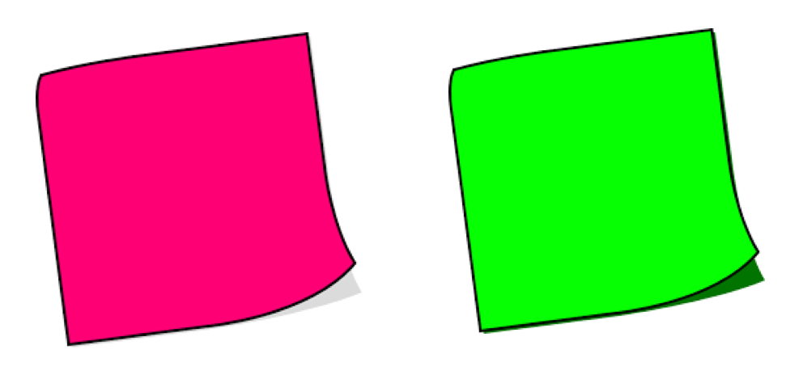
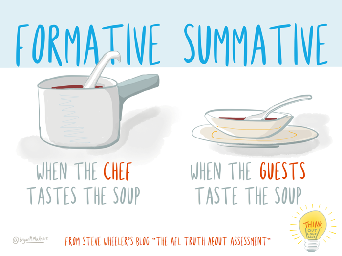
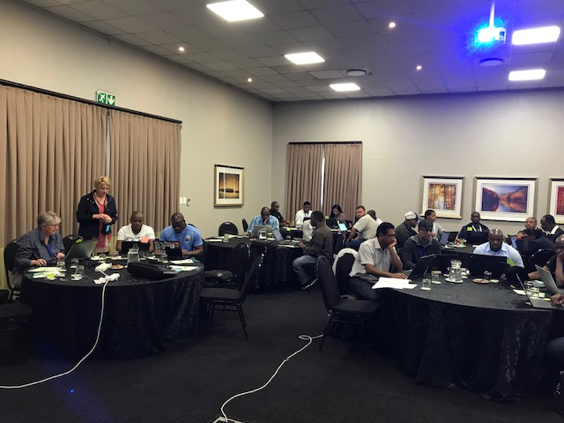
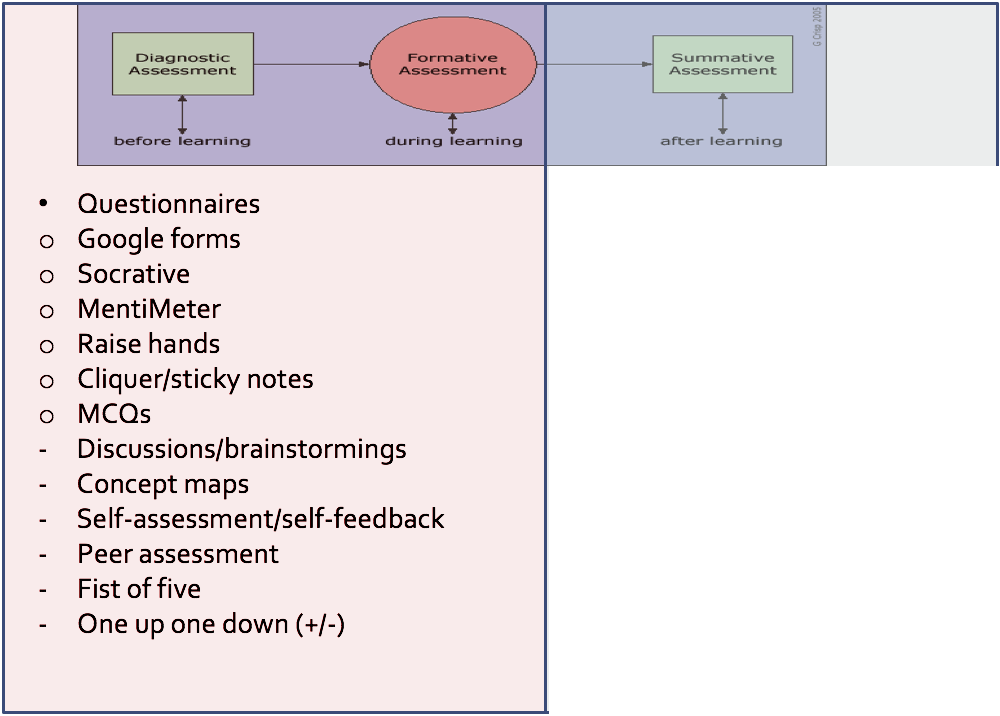
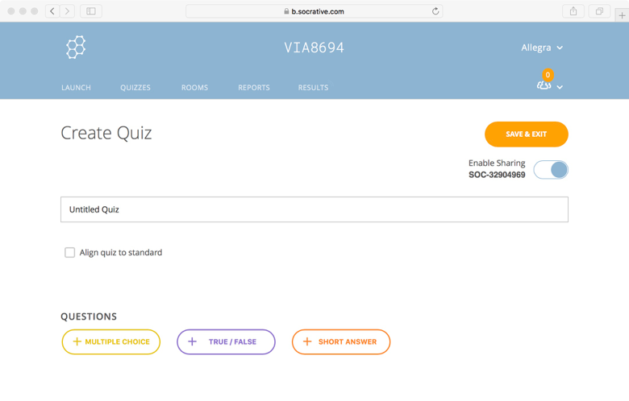
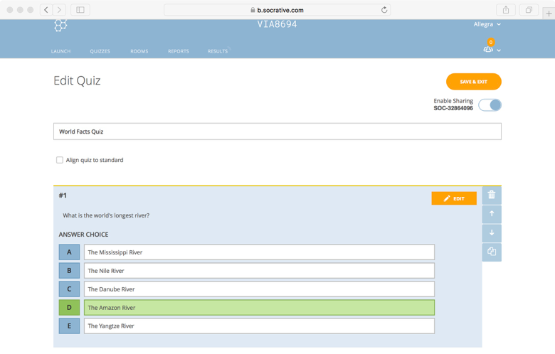
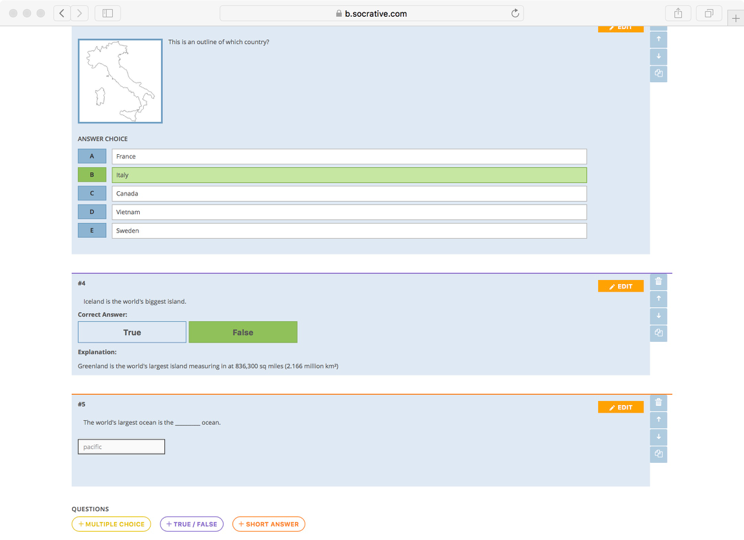

## Pre-course assessment - Diagnostic questionnaires

- Anonymous questionnaires allow us to have an idea of the level of knowledge of the whole group of learners.

- Non-anonymous and personal questionnaires allow us to find out if the learner has a necessary pre-required knowledge, and in the negative case indicate an appropriate teaching choice to palliate this lack.

> ## Challenge 1 - Who would feel comfortable with giving a definition of "formative assessment"? (5 min)
>
> 
>
> [Fill out his form](http://bit.ly/2VZA8Fr)
{: .challenge}

## The purpose of formative assessment

### Formative assessment can be used to collect information about learners'
- goals and objectives
  - Are learners' goals and objectives aligned with the course's goals and outcomes?
- Frequent mistakes
  - Which types of mistakes need special attention?
  
  
  
## How to carry out formative assessment

### The best teachers...
- Constantly monitor what is happening to students as they set about learning, as well as pay attention and investigate whether things are proceeding according to plan and as expected.
- They also question their own methods so they might get better at ensuring that their students learn successfully.

### It can be done in many different ways
- Asking questions to learners and getting responses orally.
- Asking them to describe the strategy they would adopt to solve a problem.
- Asking them to solve a problem in groups, or individually but in front of the class.
- Using brainstorming and discussions.
- Providing diagnostic questionnaire.
- Providing MCQs with distractors.

### Tools

#### [Socrative](https://b.socrative.com/)

#### [Mentimeter](https://www.mentimeter.com)

  
  

