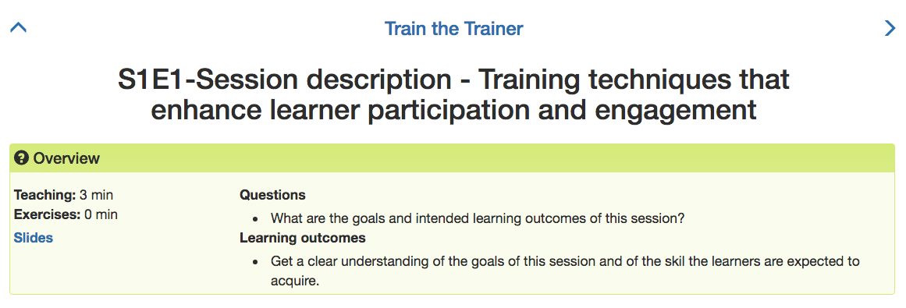
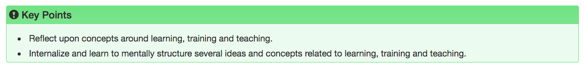

# Episode-Editing Guide

 

## Table Of Contents

- [Summary](#Summary)
- [Introduction](#Introduction)
- [Editing Instructions and Guidelines](#Editing-Instructions-and-Guidelines)
  - [Episode File Structure](#Episode-File-Structure)
    - [YAML Header](#YAML-Header)
    - [Website Content](#Website-Content)
    - [Liquid Comment Section](#Liquid-Comment-Section)
      - [GitHub-Only](#GitHub-Only)
      - [Slides Content](#Slides-Content)
  - [Editing](#Editing)
    - [Main concerns](#Main-concerns)
    - [File Creation and Naming](#File-Creation-and-Naming)
    - [HackMD Editing](#HackMD-Editing)
      - [Setting Up HackMD](#Setting-Up-HackMD)
        - [HackMD Account](#HackMD-Account)
        - [Browser Extension](#Browser-Extension)
        - [Permissions](#Permissions)
          - [GitHub Permissions](#GitHub-Permissions)
          - [HackMD Permissions](#HackMD-Permissions)
        - [HackMD Basics](#HackMD-Basics)
          - [Notes](#Notes)
          - [Push and Pull](#Push-and-Pull)
    - [GitHub Editing](#GitHub-Editing)
    - [Editing the YAML Header](#Editing-the-YAML-Header)
  
 

## Summary

This is a guide for anyone who wants to edit these episodes. The reason for having such a guide is that, unlike many simpler repositories, the episode files in this folder might undergo some extra automatic transformations after each edit/commit. They are also meant to be used both by GitHub Pages and HackMD, which requires some extra care with the formatting.

 

## Introduction

Below you will find a careful explanation of how to edit each file. Despite not being strictly necessary, if you want to dig a bit deeper and better understand some of the transformations that the files might undergo, as well as the scripts that execute them, you can check these links:

- [Workflows](../.github/workflows)
- [Lesson-building scripts](../bin/build_lesson)

The links take you to the **.github/workflows** folder and to the  **bin/build_lesson** folder, respectively. Both of them are folders in this repository.

The first folder contains files that are meant to be executed by _GitHub Actions_. You will find there a file named **build_lesson_wf.yml**, which is a yaml file, and recognised by GitHub as a workflow. What this means is that GitHub will execute the code in this file whenever some event is detected. The events that trigger it are defined within the file itself, but you can also find that information in the README.md file in that folder.

The second folder contains the actual script that is run by the aforementioned workflow, as well as a yaml file containing data pertaining to the episode titles and their relative order. It also contains a README.md file with further information.

 

## Editing Instructions and Guidelines

 

### Episode File Structure

Each episode markdown file can be composed of three different sections, two of which can be omitted:

- **YAML Header** (cannot be omitted) 
- **Website Content**
- **Liquid Comment Section**

The **Liquid Comment Section** can, in turn, be composed of two different subsections, both of which can be omitted:

- **GitHub-Only**
- **Slides Content**

 

#### YAML Header

A section of this type should be found at the top of the episode file. It is the only one that cannot be omitted, otherwise the file will not be recognised as an episode. It follows the YAML syntax and looks as depicted below, although the order in which the key-value pairs appear might differ (in the YAML syntax the order of these pairs is not relevant for the correct parsing of the information therein contained).

As you can see in the example below, there are seven keys (also referred to as fields):

- exercises
- keypoints
- outcomes
- questions
- slides_url
- teaching
- title

 

**Example 1**
~~~
---
exercises: 0
keypoints:
- Reflect upon concepts around learning, training and teaching.
- Internalize and learn to mentally structure several ideas and concepts related to
  learning, training and teaching.
outcomes:
- Get a clear understanding of the goals of this session and of the skil the learners
  are expected to acquire.
questions:
- What are the goals and intended learning outcomes of this session?
slides_url: https://hackmd.io/@nyTtT/r1tHvVR4w#/
teaching: 3
title: S1E1-Session description - Training techniques that enhance learner participation
  and engagement

---
~~~

 

The information in the YAML header is chiefly responsible for generating the header in the corresponding website and episode (which follows a _Carpentries_ template), as well as the **Key Points** section (which, if it exists, can be found at the bottom of the each episode page). **Example 1** above would generate the following header and **Key Points** section (**Fig 1** and **Fig 2**):

 

**Fig 1**

 

**Fig 2**

 

#### Website Content

#### Liquid Comment Section

##### GitHub-Only

##### Slides Content

### Editing

#### Main Concerns

images
slides

#### File Creation and Naming

#### HackMD Editing

#### Setting Up HackMD

##### HackMD Account

##### Browser Extension

##### Permissions

###### GitHub Permissions

###### HackMD Permissions

##### HackMD Basics

###### Notes

- Episode Notes
- Slides Note

###### Push and Pull

- if you forget to pull

- don't switch

#### GitHub Editing

#### Editing the YAML Header

