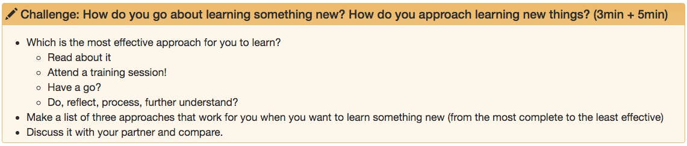
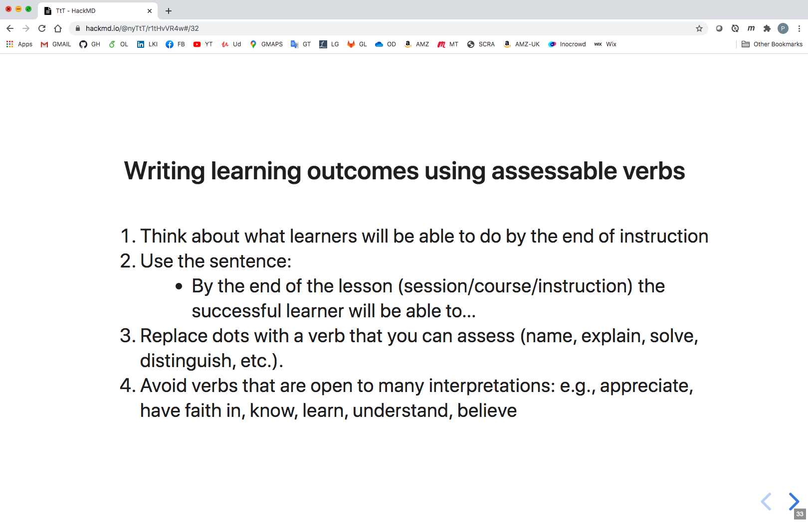
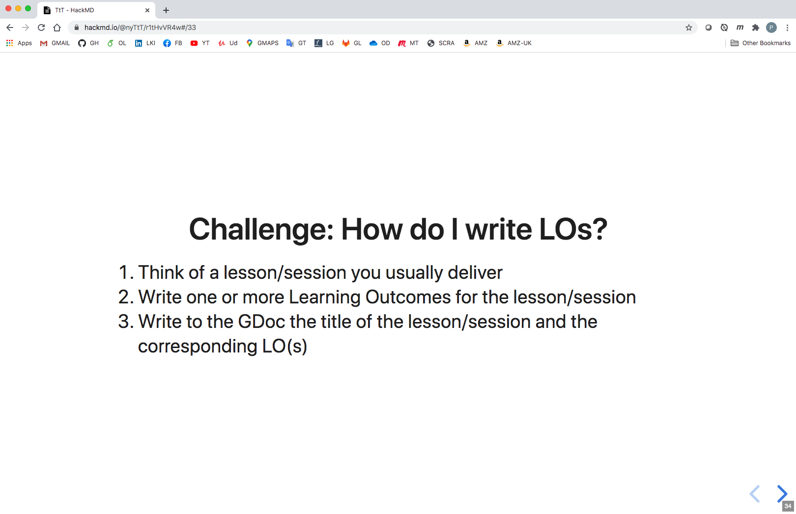
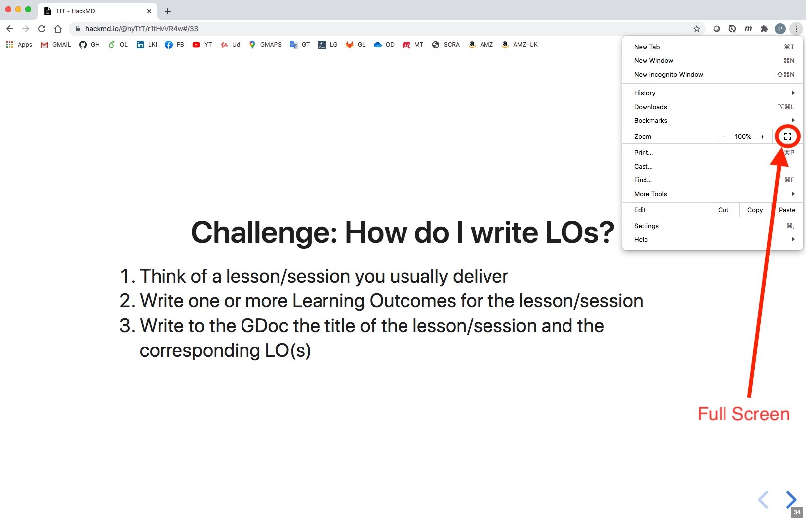

# Episode-Editing Guide

 

## Table Of Contents

- [Summary](#Summary)
- [Introduction](#Introduction)
- [Editing Instructions and Guidelines](#Editing-Instructions-and-Guidelines)
  - [Episode File Structure](#Episode-File-Structure)
    - [YAML Header](#YAML-Header)
    - [Website Content](#Website-Content)
    - [Challenges](#Challenges)
    - [Liquid Comment Section](#Liquid-Comment-Section)
      - [GitHub-Only](#GitHub-Only)
      - [Slides Content](#Slides-Content)
        - [Full Presentation](#Full-Presentation)
  - [Editing](#Editing)
    - [Main concerns](#Main-concerns)
    - [File Creation and Naming](#File-Creation-and-Naming)
    - [HackMD Editing](#HackMD-Editing)
      - [Setting Up HackMD](#Setting-Up-HackMD)
        - [HackMD Account](#HackMD-Account)
        - [Browser Extension](#Browser-Extension)
        - [Permissions](#Permissions)
          - [GitHub Permissions](#GitHub-Permissions)
          - [HackMD Permissions](#HackMD-Permissions)
      - [HackMD Basics](#HackMD-Basics)
        - [Notes](#Notes)
        - [Push and Pull](#Push-and-Pull)
    - [GitHub Editing](#GitHub-Editing)
    - [Editing the YAML Header](#Editing-the-YAML-Header)
  
 

## Summary

This is a guide for anyone who wants to edit these episodes. The reason for having such a guide is that, unlike many simpler repositories, the episode files in this folder might undergo some extra automatic transformations after each edit/commit. They are also meant to be used both by GitHub Pages and HackMD, which requires some extra care with the formatting.

 

## Introduction

Below you will find a careful explanation of how to edit each file. Despite not being strictly necessary, if you want to dig a bit deeper and better understand some of the transformations that the files might undergo, as well as the scripts that execute them, you can check these links:

- [Workflows](../.github/workflows)
- [Lesson-building scripts](../bin/build_lesson)
- [Slides Resources](../slides)

 

The links take you to the **.github/workflows**, **bin/build_lesson** and **slides** folders, respectively. All of them are folders in this repository.

The first folder contains files that are meant to be executed by _GitHub Actions_. You will find there a file named **build_lesson_wf.yml**, which is a yaml file, and recognised by GitHub as a workflow. What this means is that GitHub will execute the code in this file whenever some event is detected. The events that trigger it are defined within the file itself, but you can also find that information in the README.md file in that folder.

The second folder contains the actual script that is run by the aforementioned workflow, as well as a yaml file containing data pertaining to the episode titles and their relative order. It also contains a README.md file with further information.

The third folder contains not only the markdown file with the final slides content, which is called **slides.md**, but also two other markdown files with information that is automatically added to the first one. It also contains a README.md file with further information.

 

## Editing Instructions and Guidelines

 

### Episode File Structure

Each episode markdown file can be composed of three different sections, two of which can be omitted:

- **YAML Header** (cannot be omitted) 
- **Website Content**
- **Liquid Comment Section**

The **Liquid Comment Section** can, in turn, be composed of two different subsections, both of which can be omitted:

- **GitHub-Only**
- **Slides Content**

 

#### YAML Header

A section of this type should be found at the top of the episode file. It is the only one that cannot be omitted, otherwise the file will not be recognised as an episode. It follows the YAML syntax and looks as depicted below, although the order in which the key-value pairs appear might differ (in the YAML syntax the order of these pairs is not relevant for the correct parsing of the information therein contained).

 

**Example 1**
~~~
---
exercises: 0
keypoints:
- Reflect upon concepts around learning, training and teaching.
- Internalize and learn to mentally structure several ideas and concepts related to
  learning, training and teaching.
outcomes:
- Get a clear understanding of the goals of this session and of the skil the learners
  are expected to acquire.
questions:
- What are the goals and intended learning outcomes of this session?
slides_url: https://hackmd.io/@nyTtT/r1tHvVR4w#/
teaching: 3
title: S1E1-Session description - Training techniques that enhance learner participation
  and engagement

---
~~~

 

As you can see in the example above, there are seven keys (also referred to as fields):

- exercises
- keypoints
- outcomes
- questions
- slides_url
- teaching
- title

 

The information in the YAML header is chiefly responsible for generating the header in the corresponding website and episode (which follows a _Carpentries_ template), as well as the **Key Points** section (which, if it exists, can be found at the bottom of each episode page). **Example: YAML Header** above would generate the following header and **Key Points** section (**Fig: YAML Header** and **Fig: Key Points**):

 

**Fig: YAML Header**

 

**Fig: Key Points**

 

In the header, **Slides** (in blue) is a link to whatever URL is assigned to the 'slides_url' field in **Example: YAML Header**. The link will take you to the first slide of that episode. In case an episode does not have any slides, the link will take you to the first slide of the last episode before that one that had slides.

 

#### Website Content

Below the YAML header, everything you write is what we call the main body of the file. All of the content in that main body, apart from comments, will feature on the website, in the webpage corresponding to the episode. In the next section ([Liquid Comment Section](#Liquid-Comment-Section)) we will show you how to add comments to the main body. These will be written within a tag defined in the Liquid template language, for which reason we might also refer to them as Liquid comments.

 

##### Challenges

Carpentries-style websites can have pre-defined sections for their episodes, which will have a specific look and feel, depending on their purpose. The one that is particularly relevant to us is the **Challenge** section, which looks as depicted below (**Fig: Challenge**):

 

**Fig: Challenge**

 

Below you can see the piece of markdown text and liquid tag responsible for generating the section above:

~~~
> ## Challenge: Teaching or training? (3 min + 3 min)
>
> - Based on your experience, what are in your opinion the differences between teaching and training?
> - Identify two main differences
> - Discuss them with your partner
> - Write them in the Gdoc (share them with us)
{: .challenge}
~~~

 

Notice the two aspects needed to create a **Challenge** section:

- **Greater than** symbol (**>**) before every line of text. The empty space between every **>** and the first letter of each line is unnecessary and changes nothing about the rendering (we use it merely for readability purposes in the markdown file itself). 
- The **{: .challenge}** tag at the end of the piece of text.

 

The empty line between the first and third lines is unnecessary and changes nothing about the rendering (we use it merely for readability purposes in the markdown file itself).

We should note that the text in the first line is absolutely up to you. There is no need to include the word **Challenge**, nor the particular header type that we show in the example (in our case, the **##** header type). Our use of these was a choice.

We recommend not numbering the **Challenge** sections, as this makes it harder to maintain the episodes. If you were to number them and you wanted to add a new **Challenge** you would have to change the numbering of all the subsequent challenges. This is only practical if there is an automatic mechanism to do so, which is not the case.

 

#### Liquid Comment Section

Since Carpentries-style websites use the Liquid template language they can also make use of the comment tags that come with the latter. If you want to add a comment that will not show up on the website, you just have to write it within the beginning tag **** and the ending tag ****. Here is an example:

 

~~~


This is a comment in the Liquid template language. It will not show up on the website, but you can still see it on a
text file or on a markdown viewer, like the one on GitHub. The empty lines right after the beginning tag and right
before the ending tag are a matter of choice.


~~~

 

##### GitHub-Only

If there is content that you would like to add to the markdown files (e.g. for people to read using the GitHub markdown viewer) but to not show up on the website, you can use the Liquid comment anywhere and as many times as you would like on the text.

 

##### Slides Content

Since Liquid comments are invisible to the generated website, we use it here to also add the content for the slides. The slides are meant to be shown using [HackMD](https://hackmd.io/team/nyTtT?nav=overview).

In order to add content fto the slides we use the **$$$** tag within the liquid comment tags. So, it would look something like this:

 

~~~


This is a comment in the Liquid template language. It will not show up on the website, but you can still see it on
a text file or on a markdown viewer, like the one on GitHub. The empty lines right after the beginning tag and right
before the ending tag are a matter of choice.

$$$
This is content that will not show up on the website, since it is within the Liquid comment tags, but it will be used
in the slides.
$$$

This is another comment in the Liquid template language.


~~~

 

We recommend not leaving an empty line between the **$$$** tags and the content, as it may lead to bad formatting.

There is one other thing to consider when building the slides - how does one delimit the content for just one slide?
The way to tell HackMD that a slide is over and another one begins is by adding three dashes (**---**) between them. **Example: Slide Delimiter** illustrates this:

 

**Example: Slide Delimiter**

~~~


$$$
This is content for a slide

---

This is content for the next slide
$$$


~~~

 

However, as you will see in the next section, in our case, we will have to be a bit more careful.

 

###### Full Presentation

The full presentation is built by the python script **build_lesson.py**. It extracts the slides content from each episode and concatenates
them into one markdown file. Because of this, we also have to add the delimiter to the end of the last slide, not just between slides. **Example: Episode Slides** illustrates this.

 

**Example: Episode Slides**
~~~


$$$
### Writing learning outcomes using assessable verbs

 

1. Think about what learners will be able to do by the end of instruction
2. Use the sentence:
    - By the end of the lesson (session/course/instruction) the successful learner will be able to......... 
3. Replace dots with a verb that you can assess (name, explain, solve, distinguish, etc.).
4. Avoid verbs that are open to many interpretations: e.g., appreciate, have faith in, know, learn, understand, believe

---

## Challenge: How do I write LOs?

1. Think of a lesson/session you usually deliver 
2. Write one or more Learning Outcomes for the lesson/session
3. Write to the GDoc the title of the lesson/session and the corresponding LO(s)

---
$$$


~~~

 

**Note:** the   tag allows you to enter an extra empty line. It is useful when you want to bigger spacing content in a markdown file.

 

As you can see, even the last piece of content has to have a delimiter. The result will look like in **Fig: Episode Slides 1**
and **Fig: Episode Slides 2**

 

**Fig: Episode Slides 1**

 

**Fig: Episode Slides 2**

 

As a reminder, you can also see the presentation in full screen. To do this in Chrome, do the following:

1. Go to the top right corner.
2. Click the three vertical dots. A drop-down menu will appear.
3. Go to the Full Screen symbol, as shown in **Fig: Full Screen**. Click it.
4. If you want to exit Full Screen mode you can try the Esc button or going with the mouse pointer to either the left or the right top corner of
the screen (Mac is usually left, while Windows is usually right), until the window buttons appear and allow you to set the screen to Normal mode.
 

**Fig: Full Screen**

 

Notice that in all the slide figures above you can see a little grey box in the bottom right corner of the screen. This indicates the slide number.

If you are not in Full Screen mode you should also be able to see the address bar. There will be a number at the end of the web address of each slide page. This is not the slide number, but it is close. It is the slide number - 1. It provides a way for you to jump to any slide you want, simply by going to the address bar and typing the number.

 

### Editing

#### Main Concerns

##### Why we need HackMD

As mentioned before, this lesson/course uses [HackMD](https://hackmd.io/team/nyTtT?nav=overview). The sole purpose of this is to easily generate
slides corresponding to the content shown on the website. The reason for using HackMD for slides (instead of Powerpoint) was to have its content be versionable. HackMD is a user-friendly online tool to create and edit markdown files (as its name implies). It was also built from the start to sync with GitHub, which is where the versioning capabilities come from. Moreover, markdown files on HackMD can be shared by different users, which makes them amenable
to collaborative work.

As you will see in the following sections, the episodes of this lesson can both be edited on GitHub directly or on HackMD. However, if you want the slides
to work, you will always need to go to the slides file on HackMD and pull the most recent version from GitHub (if you already have the latest version of the slides on HackMD then you won't need to do anything).

You might be wondering if you can edit everything on GitHub and just use HackMD to pull the most recent version of the slides. This is almost true, except for one thing: **images**. HackMD only recognises images that have been uploaded into its platform. So, if you want your images to display, you will have to use
HackMD to upload the images there. Luckily, that is extremely easy.

In conclusion, having a presentation that is versionable on GitHub is not yet very straightforward. Maybe in the future there will be an easier way of doing it, but for now, we need to use a tool like HackMd in conjunction with GitHub to achieve that goal. Once you get used to it though, it will not be that hard.
We aim to make this section of the guide as complete and easy to follow as possible, so that you know how to do it.

 

#### File Creation and Naming

add episodes to lesson structure first. why? what happens if you don't?

no duplicate names, avoid symbols like ?, :

name it whatever, but make sure it has an .md at the end

do not add files with no yaml header - might not build the website

de-synching from HackMD if file name changes (whether it is the prefix or the title)
  pulling won't work
  go through github hackmd edit button

#### HackMD Editing

##### Setting Up HackMD

###### HackMD Account

###### Browser Extension

###### Permissions

- GitHub Permissions

- HackMD Permissions

##### HackMD Basics

###### Notes

- Episode Notes
- Slides Note

###### Features

Recommendations for Adding Images
  group as one image
  resize somewhere else

##### HackMD Button

github editor also opens (you will have to exit after, saying yes to not saving changes)

##### Push and Pull

- if you forget to pull

- don't switch

- give it some time

- first time vs every other time

- exiting a note (issue)

if you edit and then push slides file from hackMD to github it won't do anything

#### GitHub Editing

give it some time

actions tab

potential issues if you don't way long enough - warning that file might have been changed
   what to do? - copy-paste
   
if you want the slides to work you still have to go to the TtT file on HackMD and pull

#### Editing the YAML Header

