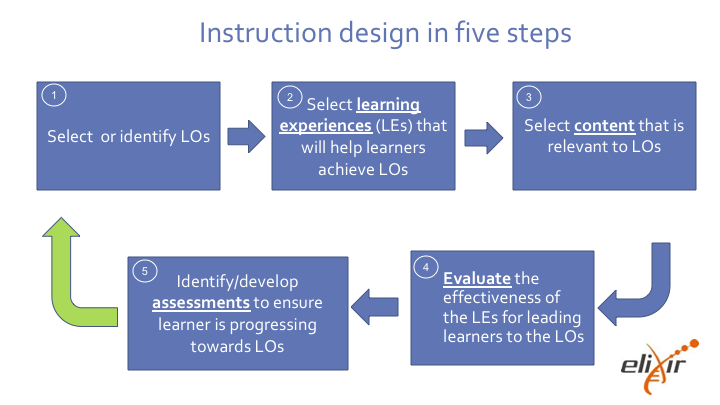

## Training Techniques to enhance learner participation and engagement

---

### Overview

- Session objectives and learning outcomes
- Introduction
- Skills for trainers
- Learning principles
- Motivation and demotivation
- Strategies for active, interactive and collaborative learning
- Wrap-up: time to relax

---

### Session objectives

 

- Reflect on your experiences in training
- Reflect on the 7 principles of learning
- Show strategies to enhance learning
- Practice good training strategies, and connect strategies to prior knowledge

---

### Session learning outcomes

 

- Identify learning strategy facilitating active, interactive and collaborative learning
- Describe what makes training effective
- Describe what makes an effective trainer
- List motivation and demotivation factors

---

### Introduction

 

- Section description
    - Objectives:
    - Learning outcomes:
- Topics
    - Introductory video
    - Instruction design in 5 steps

---

### Introductory video

 

https://www.youtube.com/watch?v=Z9orbxoRofI

---

## Instruction design in five steps

---

### Skills for trainers

 

- Section description
    - Objectives:
    - Learning outcomes:
- Topics
    - GOBLET trainer skill matrix
- Challenges
    - What makes a good training program
    - What makes a good trainer?
    - Reflect upon your current skills

---

### Challenge 1

Recall concrete examples of past trainings and list your thoughts (3 min)

---

### Challenge 2

 

In pairs (3 min)

What makes a good trainer?
Write down some traits that you associate with a good trainer and describe them

---

### The GOBLET skills matrix for trainers

 

---

#### Challenge 3 - Reflect upon your current skills

 

- Try to reflect on your current skills and how they fit with this matrix
    - Communication (COMM)
    - Expertise and knowledge (EK)
    - Planning and Management (PM)
    - Learner engagement (LE)
- Then share your thoughts with us

---

### Learning principles

 

- Section description
    - Objectives:
    - Learning outcomes:
- Topics
    - 7 evidence-based learning principles
- Challenges
    - What is your understanding of these learning principles?

---

### 7 Evidence-based Learning Principles

 

- Principle P1: Students' prior knowledge can help or hinder learning.

- Principle P2: How students organise knowledge influences how they learn and apply what they know.

- Principle P3: Students motivation determines, directs and sustains what they do learn

---

- Principle P4: To develop mastery, students must acquire component skills, practice integrating them, and know when to apply what they have learned

- Principle P5: Goal-directed practice coupled with targeted feedback enhances the quality of sudents' learning

---

- Principle P6: Students' current level of development interacts with the social, emotional, and intellectual climate of the course to impact learning

- Principle P7: To become self-directed learners, students must learn to monitor and adjust their approaches to learning.

---

### Challenge 4 - What is your understanding of the principles of learning (10 min)?

 

- Work in groups of three
- Carefully read the principles as a group
- Pick one principle you like (with no overlap with the other groups)
- Discuss what you would do as a teacher/instructor to facilitate learning according to the principle

---

some slide

---

# End of Session

---

